Table of Contents

[Before we begin](#before-we-begin)

[Info about TL;DR](#info-about-tldr)

[Legal Disclaimer](#legal-disclaimer)

[Introduction](#introduction)

[What are the \*arrs?](#what-are-the-arrs)

[From the wiki itself:](#from-the-wiki-itself)

[In Simple terms:](#in-simple-terms)

[Prowlarr:](#prowlarr)

[Radarr](#_Toc179900229)

[Sonarr](#_Toc179900230)

[Lidarr](#_Toc179900231)

[Readarr](#_Toc179900232)

[Whisparr](#_Toc179900233)

[Bazarr](#_Toc179900234)

[Flaresolverr](#_Toc179900235)

[Overseerr](#_Toc179900236)

[Requestrr](#_Toc179900237)

[Arr-stack:](#arr-stack)

[All the different apps](#all-the-different-arr-apps)

[The apps I will cover in this guide](#the-apps-i-will-cover-in-this-guide)

[Hardware specs](#hardware-specs)

[Minimum requirements](#minimum-requirements)

[CPU](#cpu)

[RAM](#ram)

[Storage](#storage)

[Recommended requirements](#recommended-requirements)

[CPU](#cpu-1)

[RAM](#ram-1)

[Storage](#storage-1)

[Recommended NAS models for this setup](#recommended-nas-models-for-this-setup)

[Minimum](#minimum)

[Recommended](#recommended)

[Models to avoid](#models-to-avoid)

[Low-End ARM-Based NAS Models](#low-end-arm-based-nas-models)

[Why not:](#why-not)

[Models with Less Than 2 GB RAM](#models-with-less-than-2-gb-ram)

[Why not:](#why-not-1)

[Older/Legacy Models](#olderlegacy-models)

[Why not:](#why-not-2)

[Single-Bay NAS Models](#single-bay-nas-models)

[Why not:](#why-not-3)

[Models without integrated graphics](#models-without-integrated-graphics)

[Why not:](#why-not-4)

[What you need instead](#what-you-need-instead)

[Preparations](#preparations)

[Folder Structure](#folder-structure)

[Setting permissions](#setting-permissions)

[The installation](#the-installation)

[Setting up the start up script for glueTUN](#setting-up-the-start-up-script-for-gluetun)

[Firewall rules (if you have firewall set up)](#firewall-rules-if-you-have-firewall-set-up)

[WireGuard Kernel Module](#wireguard-kernel-module)

[Creating a Synology bridge network](#creating-a-synology-bridge-network)

[Docker project](#docker-project)

[Required](#required)

[GlueTUN:](#gluetun)

[Ports](#ports)

[Volumes](#volumes)

[Environment](#environment)

[VPN Service provider](#vpn-service-provider)

[Finding WireGuard details for Mullvad](#finding-wireguard-details-for-mullvad)

[Proxy](#proxy)

[Timezone](#timezone)

[Firewall Outbound Subnets](#firewall-outbound-subnets)

[Network_mode](#network_mode)

[security_opt:](#security_opt)

[Restart: always](#restart-always)

[Full GlueTUN docker-compose.yml](#full-gluetun-docker-composeyml)

[Download client](#download-client)

[network_mode](#network_mode-1)

[Environment](#environment-1)

[PUID and PGID](#puid-and-pgid)

[UMASK](#umask)

[Volumes](#volumes-1)

[Full docker-compose.yml for qbittorrent](#full-docker-composeyml-for-qbittorrent)

[Sonarr](#sonarr)

[Something important:](#something-important)

[Full docker-compose.yml file](#full-docker-composeyml-file)

[Radarr](#radarr)

[Lidarr](#lidarr)

[Prowlarr](#prowlarr-1)

[Flaresolverr](#flaresolverr)

[Overseerr](#overseerr)

[Requestrr](#requestrr)

[Putting it all together](#putting-it-all-together)

[Common Errors](#common-errors)

[Configuration of the apps](#configuration-of-the-apps)

[qBitTorrent](#qbittorrent)

[Login](#login)

[Change username and password](#change-username-and-password)

[Change downloads path](#change-downloads-path)

[Radarr](#radarr-1)

[Adding Authentication method](#adding-authentication-method)

[Adding Root Folder](#adding-root-folder)

[Changing Movie Naming Scheme](#changing-movie-naming-scheme)

[Quality Settings (File Size)](#quality-settings-file-size)

[Quality profiles](#quality-profiles)

[Sonarr](#sonarr-1)

[Adding Root Folder(s)](#adding-root-folders)

[Changing Naming Scheme(s)](#changing-naming-schemes)

[Quality Settings (File Size)](#quality-settings-file-size-1)

[Quality Profiles](#quality-profiles-1)

[Quality Profiles (Anime)](#quality-profiles-anime)

[Lidarr](#lidarr-1)

[Adding Root Folder(s)](#adding-root-folders-1)

[Quality Settings](#quality-settings)

[Connecting download client to Radarr, Sonarr and Lidarr](#connecting-download-client-to-radarr-sonarr-and-lidarr)

[Prowlarr](#prowlarr-2)

[Adding the apps to Prowlarr](#adding-the-apps-to-prowlarr)

[How do I get the API key?](#how-do-i-get-the-api-key)

[Connecting Flaresolverr](#connecting-flaresolverr)

[Adding indexers](#adding-indexers)

[Overseerr](#overseerr-1)

[Configuring Overseerr](#configuring-overseerr)

[Adding Radarr and Sonarr](#adding-radarr-and-sonarr)

[Radarr](#radarr-2)

[Sonarr](#sonarr-2)

[Requestrr](#requestrr-1)

[Configuring Requestrr](#configuring-requestrr)

[How to get Discord Application Id and Bot Token](#how-to-get-discord-application-id-and-bot-token)

[How to invite the bot to our Discord server](#how-to-invite-the-bot-to-our-discord-server)

[Connecting Requestrr to Overseerr (Or Radarr, Sonarr, Ombi)](#connecting-requestrr-to-overseerr-or-radarr-sonarr-ombi)

[TL;DR](#tldr)

[Sources](#sources)

# Before we begin

## Info about TL;DR

TL;DR is at the bottom of the docs.

## Legal Disclaimer

For legal reasons I must state that I do not condone illegal pirating of copyrighted material. This is made for educational purposes only. I expect that everyone who follows this guide will only use this for legal purposes. Please never ever use this to illegally download copyrighted material such as, but not limited to, movies and TV Shows.

## Introduction

Before we start let’s figure out your needs. Do you want to download movies, tv shows, music, e-books, comics or adult videos? Most likely you want a combination of a lot of them. We also need to figure out whether you want it to be connected to a VPN. Here is a break-down of all the apps and their use-cases:

## What are the \*arrs?

### From the wiki itself

“Lidarr, Prowlarr, Radarr, Readarr, Sonarr, and Whisparr are collectively referred to as "\*arr" or "\*arrs". They are designed to automatically grab, sort, organize, and monitor your Music, Movie, E-Book, or TV Show collections for Lidarr, Radarr, Readarr, Sonarr, and Whisparr; and to manage your indexers and keep them in sync with the aforementioned apps for Prowlarr.”

### In Simple terms

#### Prowlarr

An index manager. This just means it searches for files to download on websites you assign it.

*Radarr*:

When Prowlarr find a movie file, it gives it to Radarr. Radarr then send it over to a download client, like QBitTorrent. After it’s done downloading, Radarr takes it away from QBItTorrent again and rename the file appropriately before it puts it inside your Media library.

*Sonarr*:

Same as Radarr, but for TV shows.

*Lidarr*:

Same as Radarr, but for music

*Readarr*:

Same as Radarr, but for e-books

*Whisparr*:

Same as Radarr, but for adult videos

*Bazarr*:

Connects with Radarr and Sonarr to download subtitles for your movies and TV shows.

*Flaresolverr*:

Bypasses cloudfare solver

*Overseerr***:**

A requesting application where you browse or search for movies and TV shows, kinda like Netflix, and with a click of a button they start downloading to your own media collection!

*Requestrr***:**

Goes together with Overseerr or Radarr and Sonarr to allow for requesting through discord chat.

#### Arr-stack

The arr-stack just refers to a collection of these applications bundled and working together.

## All the different \*arr apps

Prowlarr – Index manager. It searches the torrent sites for downloads (Recommended for everyone)

Flaresolverr – Some indexers require you to solve a Cloudflare captcha. Flaresolverr can do this.

Jackett – Alternative to Prowlarr. Most find Prowlarr to be both easier to set up and better to use.

Sonarr – TV Shows/Anime Shows downloader.

Radarr – Movie downloader.

Lidarr – Music downloader.

Readarr – E-book downloader

Mylar – Comics downloader.

Bazarr – Subtitle downloader for your Movies and TV Shows.

Lazy Librarian – A program to follow authors and grab metadata for digital reading.

Whisparr – Adult videos downloader.

GlueTUN – Required for use of VPN

Plex – A frontend to your media server. It’s where you access all your media, in the style of something like Netflix. It also has a very good Spotify-like app called plexamp.

Jellyfin – Also a frontend to your media server. Jellyfin is, in contrast to Plex, open-source. This means that all of it’s features is and always will be free, but it also means that it doesn’t have the same funding and therefore might not have all of the features Plex has.

Overseerr – Allows for easy requesting of movies and TV shows to add to Plex.

Jellyseerr – Same as Overseer but for Jellyfin.

Ombi – App to request Movies and TV Shows for plex or Emby.

Requestrr – Allows for requests for Sonarr and Radarr via chat, like Discord. It can also be integrated with Ombi and Overseer.

qBitTorrent – Torrent download client.

NZBGet – NZB download client.

There are even more, but I have not gotten into these myself. These are the ones I have atleast some knowledge about.

## The apps I will cover in this guide

I would like to cover as many as possible, but I have not used or tried some of them myself. I host on Plex, so I use Overseer, and have not tried neither Jellyseer or Ombi. Even though I’m pretty sure Jellyseer is the exact same just for Jellyfin. But you should always read the official docs yourself. Anyway, the apps I will go over is:

- GlueTUN
- Prowlarr
- Flaresolverr
- Sonarr
- Radarr
- Lidarr
- Overseer
- Requestrr
- qBitTorrent

## Hardware specs

I am running all this on a DS423+, with an extra 16GB memory stick and 512GB SSD cache. I have not tested it myself on any other devices, but I have made a few google searches and asked ChatGPT for some help to determine the systems requirements. Therefore, I ask you to take these number with a grain of salt.

### Minimum requirements

#### CPU

A quad-core 64bit CPU with x86 architecture. (Docker can only run on x86, and not any ARM CPUs natively. You might be able to still try this out, but you will have to do some workarounds.) An Intel Celeron J4105 or Intel Celeron J4125 should be sufficient for basic use.

#### RAM

4GB RAM (reported by ChatGPT). I think it might be able to run on 2GB for low, basic use. But don’t expect the best performance

#### Storage

These apps don’t take up more than 2GB-5GB for database and configs.

A 2-hour movie in 480p will take 700MB-2GB space, and 3GB-6GB in 720p. A 12-episode TV show with 45 minutes long episodes will take 4GB-10GB in 480p and 12GB-27GB in 720p

### Recommended requirements

#### CPU

Intel Celeron J4125 or higher. For best performance, Intel Core i3/i5 or AMD equivalent. But since most will probably run this on a Synology, the J4125 or better is sufficient.

#### RAM

8GB RAM. For best performance, an upgrade to 16GB will make it a lot smoother.

#### Storage

A 2-hour long movie in 1080p will take 8GB-15GB storage space, and in 4k it will be about 20GB-50GB. A 12-episode show with 45 minutes long episodes will take up 35GB-60GB in 1080p and 90GB-225GB in 4k.

## Recommended NAS models for this setup

Since I assume most people will use a Synology NAS, as this is what this guide was meant for, I will list some recommendations.

### Minimum

- **Synology DS220+**
- CPU: Intel Celeron J4025 (dual-core)
- RAM: 2GB (expandable to 6GB)
- Suitable for running a few applications simultaneously with small to medium libraries.
- **Synology DS720+**
- CPU: Intel Celeron J4125 (quad-core)
- RAM: 2GB (expandable to 6GB)
- Great for small to mid-size media libraries, running Docker containers, and handling multiple tasks at once.

### Recommended

- **Synology DS920+**
- CPU: Intel Celeron J4125 (quad-core)
- RAM: 4GB (expandable to 8GB)
- Supports SSD caching, making it a solid choice for heavier workloads like streaming, transcoding, and multiple apps running concurrently.
- **Synology DS423+**
- CPU: Intel Celeron J4125 (quad-core)
- 2GB RAM (Recommended to upgrade to at least 4GB or 6GB)
- 4-bay NAS with support for 2 NVME drives
- **Synology DS1821+**
- CPU: AMD Ryzen V1500B (quad-core)
- RAM: 4GB (expandable to 32GB)
- 8-bay NAS with strong processing power for large libraries and heavy multitasking.

### Models to avoid

#### Low-End ARM-Based NAS Models

- **Synology DS216j** (Marvell Armada 385, dual-core 1.0GHz, 512MB)
- **Synology DS218j** (Marvell Armada 385, Dual-Core 1.3 GHz, 512 MB RAM)
- **Synology DS219j** (Marvell Armada 3720, Dual-core 800 MHz, 256 MB RAM)
- **Synology DS220j** (Realtek RTD1296, Quad-Core 1.4 GHz, 512 MB RAM)

##### Why not

- **CPU**: These models come with weak, low-power ARM processors that are not suited for running multiple Docker containers or handling tasks like torrenting and media management.
- **RAM**: Most of these devices have **512 MB RAM or less**, which is far too little for running multiple services in Docker.
- **Docker Support**: ARM-based models may not fully support Docker, especially for complex workloads, and will struggle with performance under even light to moderate use.

#### Models with Less Than 2 GB RAM

- **Synology DS220j** (512 MB RAM)
- **Synology DS218play** (1 GB RAM)
- **Synology DS218** (2 GB RAM)
- **Synology DS118** (1 GB RAM)

##### Why not

- **Insufficient RAM**: Apps like **Overseerr** and **qBittorrent** require more memory, and these models would quickly run out of resources. With less than 2 GB, you'll experience poor performance, constant swapping to disk, or the inability to run all your containers simultaneously.
- **No Upgrade Path**: Many of these models do not allow you to upgrade the RAM, so you're stuck with what they offer.

#### Older/Legacy Models

- **Synology DS214+** (Dual-core 1.33 GHz, 1 GB RAM)
- **Synology DS415play** (Intel Atom CE5335, Dual-core 1.6 GHz, 1 GB RAM)
- **Synology DS216play** (ARM Cortex-A9, Dual-core 1.5 GHz, 1 GB RAM)

##### Why not

- **Outdated CPU architecture**: These older CPUs lack the power and modern architecture needed for virtualization and handling Docker workloads.
- **RAM limitations**: Even if some of these have x86 architecture, 1 GB or even 2 GB of RAM is not sufficient for your use case.

#### Single-Bay NAS Models

- **Synology DS118** (Realtek RTD1296, Quad-core 1.4 GHz, 1 GB RAM)
- **Synology DS119j** (Marvell Armada 3700, Dual-core 800 MHz, 256 MB RAM)

##### Why not

- **Low performance**: These single-bay models come with very basic hardware, meaning you’ll struggle to run Docker and multiple applications.
- **No redundancy**: With only one drive, there’s no data redundancy (no RAID), which is a concern when managing large amounts of media files.

#### Models without integrated graphics

- Synology DS923+ (AMD Ryzen R1600, Quad-core 2.6GHz, 4GB RAM)
- Synology DS 1522+ (AMD Ryzen R1600, Quad-core 2.6GHz, 8GB RAM)

##### Why not

- **No integrated graphics**: Although these can work just fine, they are not ideal as you won’t be able to do hardware transcoding. For native playback of h264 files these can be perfect.

#### What you need instead

To run this full arr-stack smoothly on Docker, aim for:

- **x86-64 architecture** (with embedded graphics)
- **Minimum 4 GB RAM**, ideally **8 GB or more**.
- **Expandable RAM** for future growth.
- **At least dual-bay** for RAID redundancy.

# Preparations

## Folder Structure

I assume you have Installed container manager (docker) on your Synology system already, but if not do that now. Then we need to go into our “docker” shared folder and make some new folder.

Inside the “docker” shared folder, create a folder an call it something like “arr-stack”

Inside “arr-stack”, create these folders:

- gluetun
- lidarr
- overseer
- prowlarr
- qbittorrent
- radarr
- requestrr
- sonar

If you have any other apps beside these, create a folder for them too as described in the official docs.

Create a folder called “config” inside lidarr, overseer, prowlarr, qbittorrent, radar, requestrr and sonar.

In “qbittorrent” folder, also create a folder called “downloads”

## Setting permissions

To make sure that all the apps have the right permissions to read and write the relevant folder, we need to ssh into the NAS. I prefer PuTTY, but you can use powershell or anything else that you like.

1. SSH into your NAS
2. Type the two following commands:

- sudo chmod -R 777 /volume1/docker/arr-stack
- sudo chmod -R 777 /volume1/Media

1. Find your UID and GID

- Type: id

1. You should get an output like this:

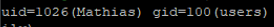

As you can see, we get an output with uid=XXXX and gid=YYY.

1. Type the two following commands:

- sudo chown -R \< UID\>:\< GID\> \\volume1\\docker\\arr-stack
- sudo chown -R \< UID\>:\< GID\> \\volume1\\Media

    **NOTE:** If you have your Media library at another location than “/volume1/Media”, then put your path in the 2 relevant commands.

These commands ensure that we have the correct permissions to read and write the files of the directories and their subdirectories.

# The installation

Now that we have our folder structure ready, let’s begin with the actual installation.

## Setting up the start up script for glueTUN

For glueTUN to start up automatically, we need to create a task on a schedule.

1. Open up control panel, then click on Task Scheduler.

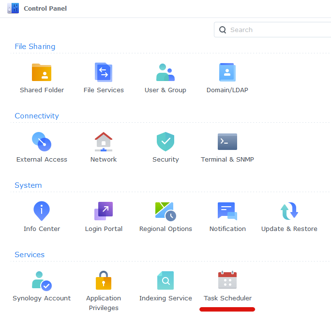

1. Next click on Create, Triggered Task then User Defined Script.

1. Now enter a name for the script. It doesn’t matter what you choose The user **must** be ‘root’ and ‘Boot-up’ for the Event. Don’t click OK yet.

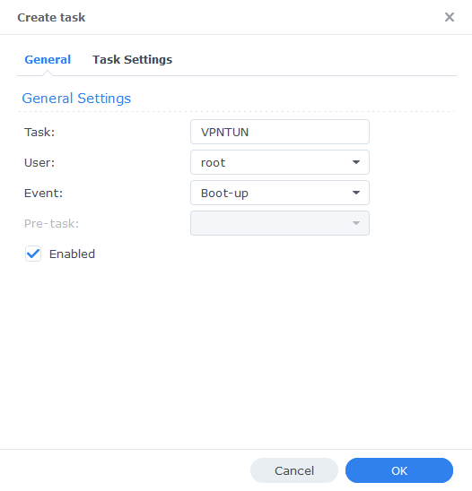

1. On the Task Settings tab copy and paste the code below in the ‘User-Defined script’ section. It will look like screenshot

    On the Task Settings tab copy and paste the code below in the ‘User-Defined script’ section:

\#!/bin/sh -e

insmod /lib/modules/tun.ko

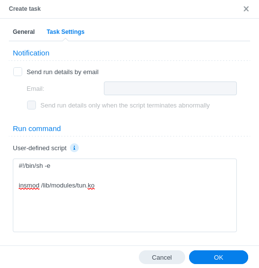

1. You can now press OK and agree to the warning message. Next run the script which will enable the TUN device.

    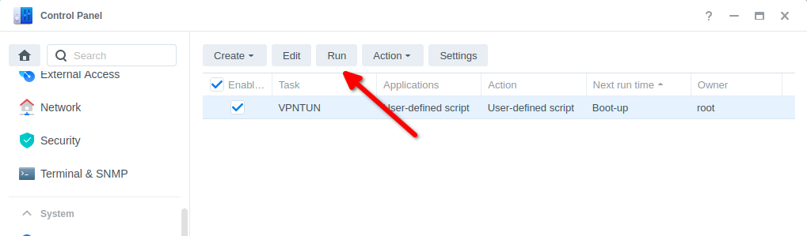

## Firewall rules (if you have firewall set up)

If you have firewall rules set up on your synology to block all outgoing connections, we need to make some exception rules.

Go into Control Panel \> Security \> Firewall

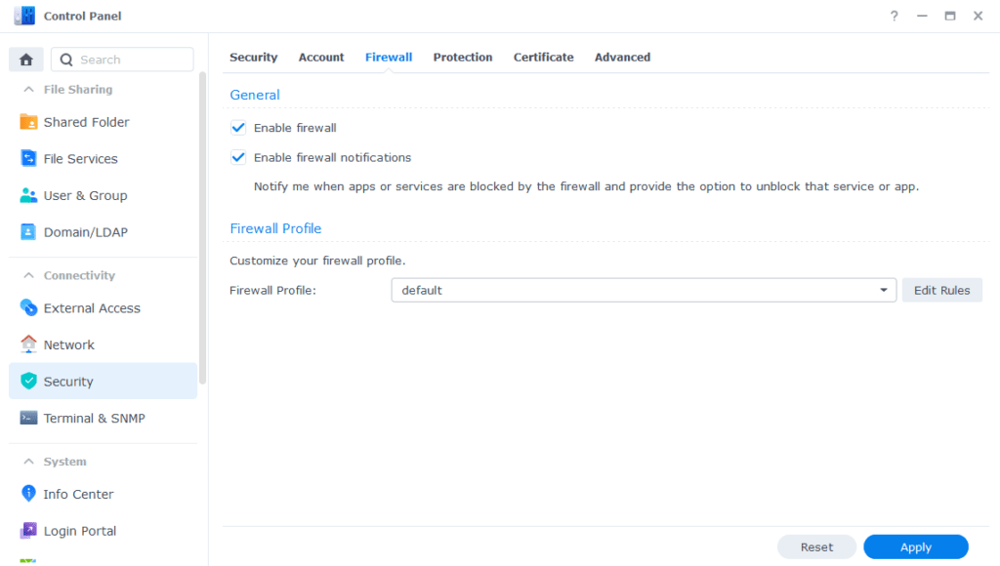

Click on Edit Rules and then click on “Create”

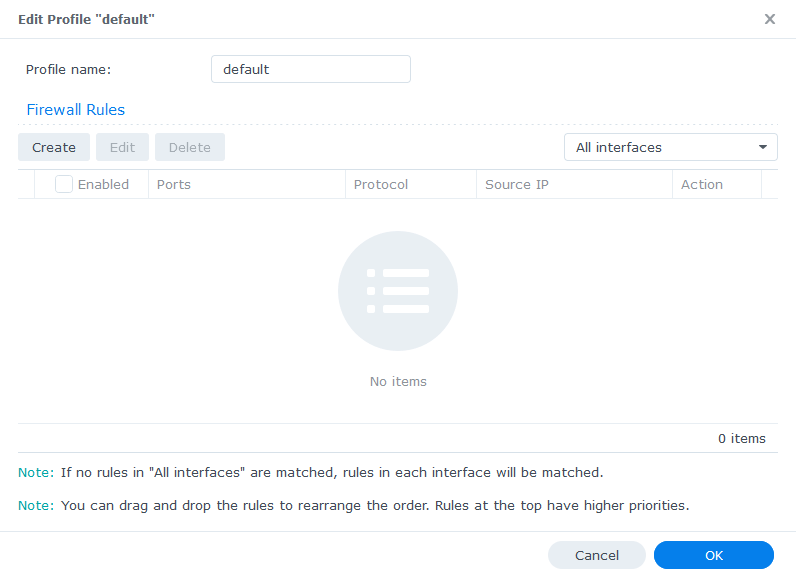

On the “Ports” section, select “Custom”

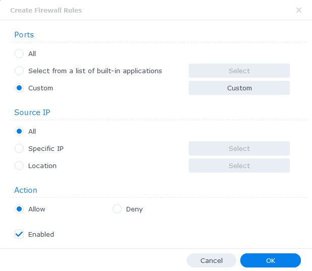

On the screen that appears select the Type as “Destination Port” and Protocol as “All”. In this example I am going to open up both 1194 and 1195 as some providers use UDP and some TCP and these are the most commonly used ports.

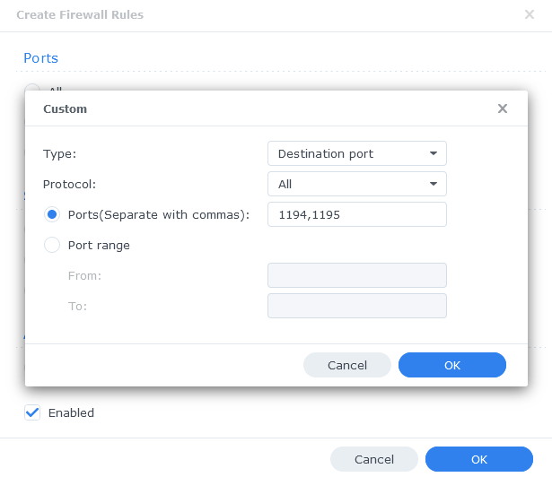

Click on OK. Leave the “Source IP” as “All” and “Action” as “Allow”, then “OK” again to apply.

## WireGuard Kernel Module

The WireGuard kernel module is not necessary, but it does lower the CPU usage a little bit. This in turn allows for better performance, better efficiency and lower electricity bills.

“The default Gluetun Wireguard setup uses a ‘Userspace’ implementation of Wireguard which normally should not use much from a CPU resource perspective. However, on Synology it tends to require high CPU utilisation. For example a 40MiB download via qBittorrent uses up to 176% in CPU (1.7 Cores) on my 1821+.”

(DrFrankenstein’s Tech Stuff)

[BlackVoid.club](https://www.blackvoid.club/) have put together a Kernel Module for Synology which allows Gluetun to use the lower level Kernel to perform Wireguard duties.

1. Open this link: <https://www.blackvoid.club/wireguard-spk-for-your-synology-nas/>
2. Find your model of NAS under the correct DSM version section (If you are following this guide it will be 7.2) and download the pre compiled .spk file
3. Head into Package Center and click ‘Manual Install’ on the top right and install the .spk file and **untick** the box to run after install

    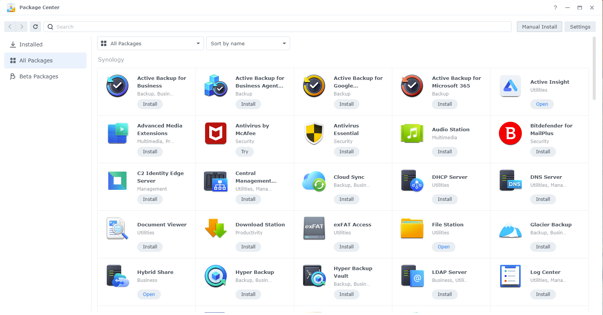

4. Reboot
5. SSH Into your NAS using PuTTY, powershell or any other SSH client and elevate yourself to root by typing “sudo -I” and entering your password
6. Enter this command and press enter to start up the module

    /var/packages/WireGuard/scripts/start

## Creating a Synology bridge network

As default, there is already a bridge network in container manager for Synology. The problem with the default one is that the Ips it assigns are not static, and therefore may change. This is fine for single containers that don’t communicate with each other, but when connecting multiple containers with IPs the IP address need to always stay the same. To remedy this we will create our own bridge network.

1. Open up container manager and click on the network tab to the left.
2. Click “Add” at the top
3. Configure the network like this:

- Subnet: 172.20.0.0/16
- IP range: 172.20.0.2/25
- Gateway: 172.20.0.1
- IPv6: Disabled
- IP Masquerade: enabled (Leave the “disable” option unticked)

## Docker project

Now we are ready to create the project. A docker project is just a collection of multiple docker containers.

1. Open “container manager” and head to the “Project” tab.
2. Click create
3. Give the project a name. I chose “arr-stack”
4. Set the path to be “docker \> arr-stack” (should say “\\docker\\arr-stack”)
5. As source, select “Create docker-compose.yml”

Now this next step will be just a little bit different for everyone. What you will put in the docker-compose, will depend on what apps you plan to use and what VPN provider you have if you will use glueTUN. But don’t worry, as you can always come back to the project and edit the docker-compose to add more apps, or to fix any potential problems that may occur. I will try my best to explain what each section does, and if it is relevant to you or not.

### Required

Everyone will need to start the docker-compose out like this:

version: "3"

services:

Then under services we will add all of our apps and configs to each app.

### GlueTUN

gluetun:

image: qmcgaw/gluetun

container_name: gluetun

hostname: gluetun

cap_add:

\- NET_ADMIN

devices:

\- /dev/net/tun:/dev/net/tun

ports:

\- 6881:6881

\- 6881:6881/udp

\# - Add all other ports required by the different apps here

volumes:

\- \<path\\to\\your\\gluetun\>:/gluetun

environment:

\- VPN_SERVICE_PROVIDER=\<your provider\>

\- VPN_TYPE=\<wireguard or openvpn\>

\- VPN_DISABLE_IPV6=true

\# OpenVPN:

\# - OPENVPN_USER=

\# - OPENVPN_PASSWORD=

\# Wireguard:

\- WIREGUARD_PRIVATE_KEY=\<your-private-key\>

\- WIREGUARD_ADDRESSES=\<your-wireguard-adress\>

\- DNS=\<your-wireguard-dns\>

\- SERVER_HOSTNAMES=\<your-hostnames\>

\- SERVER_CITIES=\<your-cities\>

\- HTTPPROXY=off \#change to on if you wish to enable

\- SHADOWSOCKS=off \#change to on if you wish to enable

\# Timezone for accurate log times

\- TZ=\<your-timezone\>

\# Server list updater

\# See <https://github.com/qdm12/gluetun-wiki/blob/main/setup/servers.md\#update-the-vpn-servers-list>

\- UPDATER_PERIOD=24h

\- FIREWALL_OUTBOUND_SUBNETS=\<synobridge-subnet\>/16,\<host-machine-subnet\>/24 \#change this in line with your subnet see note on guide

\# - FIREWALL_VPN_INPUT_PORTS=12345 \#uncomment or remove this line based on the notes below

network_mode: synobridge

labels:

\- com.centurylinklabs.watchtower.enable=false

security_opt:

\- no-new-privileges:true

restart: always

We have a lot to unpack here.

#### Ports

It is in the “ports:” section we put in all the ports we are going to use. When we look the official docker-compose.yml to all the apps, they have their ports listed under their own service. However, since we are going to use a VPN we need it to be in the glueTUN network.

#### Volumes

Here we put the path to the folder we made earlier. If you only have one volume on your synology and followed the same naming scheme as me, it should be “\\volume1\\docker\\arr-stack\\gluetun”. Then we mount it as “\\gluetun” by adding a “:”. So the full volume mapping should be “\\volume1\\docker\\arr-stack\\gluetun:\\gluetun”.

#### Environment

It’s in the environment we put in all the config settings.

##### VPN Service provider

In the “VPN_SERVICE_PROVIDER” you fill in your provider.

Here you can see a list of all the supported providers, as well as how to configure them:  
<https://github.com/qdm12/gluetun-wiki/tree/main/setup/providers>

As I am using Mullvad, that is what I will put in for my docker-compose.

You can also choose whether to use the WireGuard or OpenVPN protocol. In this example, we are using WireGuard as that is what I have found to work best.

If you don’t use Mullvad, you have to find out yourself how to configure GlueTUN for your provider, as well as figure out how to find that information to put it. But if you are using Mullvad, you can follow my guide:

##### Finding WireGuard details for Mullvad

1. Go to this link and put in your account number: <https://mullvad.net/no/account/wireguard-config>
2. Click on “Generate Key” **Note:** The displayed key is NOT the private key.
3. Choose a country, city and then the servers you wish to use. I have selected Sweden, Stockholm and all servers.
4. Click “Download zip-archive”

0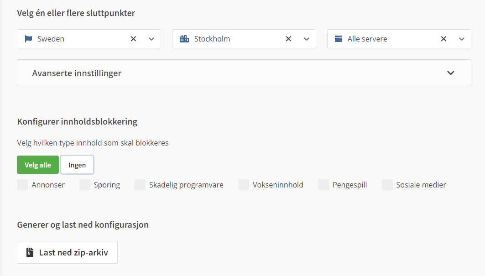

1. Inside the zip file, you will find a bunch on .conf files. (Might be .json files) Open these in notepad.
2. You only need one of them, as the relevant information is the same in every single one. You need to look at your [Interface] section and copy your “PrivateKey” as well as “Address” and “DNS”.

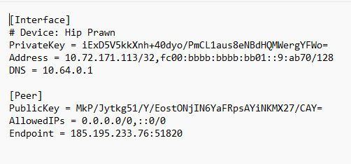

So for this example I would have to use:

“iExD5V5kkXnh+40dyo/PmCL1aus8eNBdHQMWergYFWo=” as my private key,

“10.72.171.113/32” as my address and

“10.64.0.1” as my DNS.

1. Also take note of the filenames. They should be something like “se-sto-wg-001.conf”, where “se” is the country, “sto” the city and “wg” the protocol. So for me it’s Sweden, Stockholm, WireGuard.

##### Proxy

If you are using a proxy, you can enable httpproxy and shadowsocks. I have not used it, and will therefor not go over that now.

##### Timezone

In the timezone you just put in your own timezone. To find your TZ format, find your region in this list:  
<https://en.wikipedia.org/wiki/List_of_tz_database_time_zones>

#### Firewall Outbound Subnets

In this line:

“FIREWALL_OUTBOUND_SUBNETS=\<your-bridge-subnet\>/,\<your-host-subnet\>”

We need to change the first IP to the one we just made for our synobridge. If you followed me, it will be 172.20.0.0/16. Then we will need to fill in our host machines subnet,

We have a few choices on how to identify it. If you are connected to the same network on your PC or phone, you can just figure out your IP address on your device of choice. So for PC, open “cmd” and type “ipconfig”. Look for IPv4 section.

If you have a iPhone, you can open settings \>Wi-Fi \> i (next to the Wi-Fi named) then scroll down to find “IPv4 address.” There should be a “IP Adress” field there.

The IPv4 address will probably be something like this “192.168.X.X”. Take the first 3 digits, e.g. “192.168.0” or whatever you have, then replace the last digit with a 0. So if your IP address on your phone is “192.168.0.53” the subnet would be “192.168.0.0”. Then we just add the network mask at the end. If you don’t know what that means, it’s probably /24 at the end, so the full subnet is “192.168.0.0/24”.

So my line would look like this:

“FIREWALL_OUTBOUND_SUBNETS=172.20.0.0/16,192.168.0.0/24”

#### Network_mode

We just need to specify it to use the network we created earlier. Leave it as is.

#### security_opt

This line just makes it so Watchtower doesn’t update it automatically if you use that. That is because it will break the whole arr-stack each time. So best practice would be to just leave it in.

#### Restart: always

This line tells the container to restart if it shuts down unexpectedly.

#### Full GlueTUN docker-compose.yml

With all of the info above, I now need you to make the appropriate edits for your docker-compose. This will be mine for this example:

gluetun:

image: qmcgaw/gluetun

container_name: gluetun

hostname: gluetun

cap_add:

\- NET_ADMIN

devices:

\- /dev/net/tun:/dev/net/tun

ports:

\- 6881:6881

\- 6881:6881/udp

\# - 8888:8888/tcp \# HTTP proxy

\# - 8388:8388/tcp \# Shadowsocks

\# - 8388:8388/udp \# Shadowsocks

\- 8085:8085 \# qbittorrent

\- 8989:8989 \# Sonarr

\- 9696:9696 \# Prowlarr

\- 7878:7878 \# Radarr

\- 8686:8686 \#Lidarr

\- 8191:8191 \#FlareSolverr

\- 5055:5055 \#Overseer

\- 4545:4545 \#Requestrr

volumes:

\- \\volume1\\docker\\arr-stack\\gluetun:/gluetun

environment:

\- VPN_SERVICE_PROVIDER=mullvad

\- VPN_TYPE=wireguard

\- VPN_DISABLE_IPV6=true

\# OpenVPN:

\# - OPENVPN_USER=

\# - OPENVPN_PASSWORD=

\# Wireguard:

\- WIREGUARD_PRIVATE_KEY= iExD5V5kkXnh+40dyo/PmCL1aus8eNBdHQMWergYFWo=

\- WIREGUARD_ADDRESSES=10.72.171.113/32

\- DNS=10.64.0.

\- SERVER_HOSTNAMES=se-sto-wg-001,se-sto-wg-002,se-sto-wg-003,se-sto-wg-004

\- SERVER_CITIES=stockholm

\- HTTPPROXY=off \#change to on if you wish to enable

\- SHADOWSOCKS=off \#change to on if you wish to enable

\# Timezone for accurate log times

\- TZ=Europe/Oslo

\# Server list updater

\# See <https://github.com/qdm12/gluetun-wiki/blob/main/setup/servers.md\#update-the-vpn-servers-list>

\- UPDATER_PERIOD=24h

\- FIREWALL_OUTBOUND_SUBNETS=172.20.0.0/192.168.0.0/24 \#change this in line with your subnet see note on guide

\# - FIREWALL_VPN_INPUT_PORTS=12345 \#uncomment or remove this line based on the notes below

network_mode: synobridge

labels:

\- com.centurylinklabs.watchtower.enable=false

security_opt:

### Download client

The best download client in my opinion is qBitTorrent and is therefore what I will use today. Here is the docker-compose:

qbittorrent:

image: lscr.io/linuxserver/qbittorrent

container_name: qbittorrent

network_mode: "service:gluetun"

environment:

\- PUID=\<your-UID\>

\- PGID=\<your-GID\>

\- TZ=\<your-timezone\>

\- WEBUI_PORT=8085

\- UMASK=022

volumes:

\- \\path\\to\\your\\config:/config

\- \\path\\to\\your\\downloads:/downloads

\- \\path\\to\\your\\media:/media

depends_on:

gluetun:

condition: service_healthy

security_opt:

\- no-new-privileges:true

restart: always

#### network_mode

If you also are using a VPN, and therefore by extension gluetun, you will need to set network_mode to “service:gluetun”. If you don’t use VPN, you can just do “network_mode: bridge” or any other network you have set up.

#### Environment

##### PUID and PGID

For PUID and PGID you need to find the ID for your user. To do this, SSH into your synology, log in to your own user, then type “id”. The output should include UID (user ID) and GID (Group ID).

##### UMASK

I simply don’t have enough information on this to tell you what it is or how it works. If you are interested, you can read here: <https://en.wikipedia.org/wiki/Umask>

##### Volumes

If you followed me in the creation of the directories, it should be:  
  
\\volume1\\docker\\arr-stack\\qbittorrent\\config

\\volume1\\docker\\arr-stack\\qbittorrent\\downloads

For your Media library, you will have to find your own path. But a good assumption would be that you have it all in a shared folder like me, so “\\volume1\\Media” with subdirectories under it with Movies, TV Shows etc.

#### Full docker-compose.yml for qbittorrent

The full docker-compose could look something like this:

qbittorrent:

image: lscr.io/linuxserver/qbittorrent

container_name: qbittorrent

network_mode: "service:gluetun"

environment:

\- PUID=1026

\- PGID=100

\- TZ=Europe/Oslo

\- WEBUI_PORT=8085

\- UMASK=022

volumes:

\- /volume1/docker/arr-stack/qbittorrent/config:/config

\- /volume1/docker/arr-stack/qbittorrent/downloads:/downloads

\- /volume1/Media:/media

depends_on:

gluetun:

condition: service_healthy

security_opt:

\- no-new-privileges:true

restart: always

### Sonarr

This is the docker-compose.yml

sonarr:

image: lscr.io/linuxserver/sonarr:latest

container_name: sonarr

network_mode: "service:gluetun"

environment:

\- PUID=1026

\- PGID=100

\- TZ=Europe/Oslo

volumes:

\- /path\\to\\your\\config:/config

\- /path\\to\\your\\media:/tv

\- /path\\to\\your\\\\download-client\\downloads:/downloads

depends_on:

gluetun:

condition: service_healthy

restart: unless-stopped

We have already covered most of the components in the docker-compose file, so I won’t repeat myself. The only thing I want to mention is the fact that if you separate your TV shows and Anime shows in your Media folder, like me, you need to mount both of them here.

#### Something important

The path to the downloads **NEED** to be the same path you chose for qBitTorrent (or whatever download client you used). It must match exactly, so be sure to double check that. If they don’t match, sonar won’t be able to grab the downloaded files and move them.

#### Full docker-compose.yml file

sonarr:

image: lscr.io/linuxserver/sonarr:latest

container_name: sonarr

network_mode: "service:gluetun"

environment:

\- PUID=1026

\- PGID=100

\- TZ=Europe/Oslo

volumes:

\- /volume1/docker/arr-stack/sonarr/config:/config

\- /volume1/Media/TV Shows:/tv

\- /volume1/Media/Anime TV Shows:/anime

\- /volume1/docker/arr-stack/qbittorrent/downloads:/downloads

depends_on:

gluetun:

condition: service_healthy

restart: unless-stopped

### Radarr

Here we have radarr’s docker-compose:

radarr:

image: lscr.io/linuxserver/radarr:latest

container_name: radarr

network_mode: "service:gluetun"

environment:

\- PUID=1026

\- PGID=100

\- TZ=Europe/Oslo

volumes:

\- /volume1/docker/arr-stack/radarr/config:/config

\- /volume1/Media/Movies:/movies

\- /volume1/docker/arr-stack/qbittorrent/downloads:/downloads

depends_on:

gluetun:

condition: service_healthy

restart: unless-stopped

So as you can see, it’s identical to sonarr’s, except for the image and name aswell as the volume mounts.

### Lidarr

Docker-compose:

lidarr:

image: lscr.io/linuxserver/lidarr:latest

container_name: lidarr

network_mode: "service:gluetun"

environment:

\- PUID=1026

\- PGID=100

\- TZ=Europe/Oslo

volumes:

\- /volume1/docker/arr-stack/lidarr/config:/config

\- /volume1/Media/Music:/Music

\- /volume1/docker/arr-stack/qbittorrent/downloads/:/downloads

depends_on:

gluetun:

condition: service_healthy

restart: unless-stopped

Again, we have a pretty familiar looking docker-compose file. Edit the appropriate settings just like you did for radar.

### Prowlarr

Prowlarr is what we use to search for the files we are going to download. Here is the docker-compose:

prowlarr:

image: lscr.io/linuxserver/prowlarr:latest

container_name: prowlarr

network_mode: "service:gluetun"

environment:

\- PUID=1026

\- PGID=100

\- TZ=Europe/Oslo

volumes:

\- path\\to\\your/config:/config

depends_on:

gluetun:

condition: service_healthy

restart: unless-stopped

Obviously change the PUID and PGID. Other than that we only have to change the config path. It should be “\\volume1\\docker\\arr-stack\\prowlarr\\config”.

### Flaresolverr

Docker-compose:

flaresolverr:

image: ghcr.io/flaresolverr/flaresolverr:latest

container_name: flaresolverr

network_mode: "service:gluetun"

environment:

\- TZ=Europe/Oslo

depends_on:

gluetun:

condition: service_healthy

security_opt:

\- no-new-privileges:true

restart: unless-stopped

You don’t need to change anything here. Just paste it in. Only exception is if you don’t use VPN, then change “network_mode” and delete “depends_on”.

### Overseerr

Docker-compose:

overseerr:

image: sctx/overseerr:latest

container_name: overseerr

network_mode: "service:gluetun"

environment:

\- LOG_LEVEL=debug

\- TZ=Europe/Oslo

volumes:

\- \\path\\to\\your\\config:/app/config

depends_on:

gluetun:

condition: service_healthy

restart: unless-stopped

The only thing you need to change here is the path to your config. It should be “\\volume1\\docker\\arr-stack\\overseerr\\config”

### Requestrr

Docker-compose:

requestrr:

image: darkalfx/requestrr

container_name: requestrr

network_mode: "service:gluetun"

volumes:

\- \\path\\to\\your\\config:/root/config

depends_on:

gluetun:

condition: service_healthy

restart: unless-stopped

Again, only change the config path. Should be “\\volume1\\docker\\arr-stack\\requestrr\\config”

### Putting it all together

Now we can put all of our relevant docker-compose files together inside one, big file. Remember, if you want to add more -arr apps or other download-clients, you can just add them in this docker-compose just like we did for all the other apps. Just remember to open up the ports in GlueTUN as well. For me the docker-compose.yml is like this:

version: "3"

services:

gluetun:

image: qmcgaw/gluetun

container_name: gluetun

hostname: gluetun

cap_add:

\- NET_ADMIN

devices:

\- /dev/net/tun:/dev/net/tun

ports:

\- 6881:6881

\- 6881:6881/udp

\- 8085:8085 \# qbittorrent

\- 8989:8989 \# Sonarr

\- 9696:9696 \# Prowlarr

\- 7878:7878 \# Radarr

\- 8686:8686 \#Lidarr

\- 8191:8191 \#FlareSolverr

\- 5055:5055 \#Overseerr

\- 4545:4545 \#Requestrr

volumes:

\- \\volume1\\docker\\arr-stack\\gluetun:/gluetun

environment:

\- VPN_SERVICE_PROVIDER=mullvad

\- VPN_TYPE=wireguard

\- VPN_DISABLE_IPV6=true

\# OpenVPN:

\# - OPENVPN_USER=

\# - OPENVPN_PASSWORD=

\# Wireguard:

\- WIREGUARD_PRIVATE_KEY= iExD5V5kkXnh+40dyo/PmCL1aus8eNBdHQMWergYFWo=

\- WIREGUARD_ADDRESSES=10.72.171.113/32

\- DNS=10.64.0.

\- SERVER_HOSTNAMES=se-sto-wg-001,se-sto-wg-002,se-sto-wg-003,se-sto-wg-004

\- SERVER_CITIES=stockholm

\- HTTPPROXY=off \#change to on if you wish to enable

\- SHADOWSOCKS=off \#change to on if you wish to enable

\# Timezone for accurate log times

\- TZ=Europe/Oslo

\# Server list updater

\# See <https://github.com/qdm12/gluetun-wiki/blob/main/setup/servers.md\#update-the-vpn-servers-list>

\- UPDATER_PERIOD=24h

\- FIREWALL_OUTBOUND_SUBNETS=172.20.0.0/192.168.0.0/24 \#change this in line with your subnet see note on guide

\# - FIREWALL_VPN_INPUT_PORTS=12345 \#uncomment or remove this line based on the notes below

network_mode: synobridge

labels:

\- com.centurylinklabs.watchtower.enable=false

security_opt:

qbittorrent:

image: lscr.io/linuxserver/qbittorrent

container_name: qbittorrent

network_mode: "service:gluetun"

environment:

\- PUID=1026

\- PGID=100

\- TZ=Europe/Oslo

\- WEBUI_PORT=8085

\- UMASK=022

volumes:

\- /volume1/docker/arr-stack/qbittorrent/config:/config

\- /volume1/docker/arr-stack/qbittorrent/downloads:/downloads

\- /volume1/Media:/media

depends_on:

gluetun:

condition: service_healthy

security_opt:

\- no-new-privileges:true

restart: always

sonarr:

image: lscr.io/linuxserver/sonarr:latest

container_name: sonarr

network_mode: "service:gluetun"

environment:

\- PUID=1026

\- PGID=100

\- TZ=Europe/Oslo

volumes:

\- /volume1/docker/arr-stack/sonarr/config:/config

\- /volume1/Media/TV Shows:/tv

\- /volume1/Media/Anime TV Shows:/anime

\- /volume1/docker/arr-stack/qbittorrent/downloads:/downloads

depends_on:

gluetun:

condition: service_healthy

restart: unless-stopped

prowlarr:

image: lscr.io/linuxserver/prowlarr:latest

container_name: prowlarr

network_mode: "service:gluetun"

environment:

\- PUID=1026

\- PGID=100

\- TZ=Europe/Oslo

volumes:

\- /volume1/docker/arr-stack/prowlarr/config:/config

depends_on:

gluetun:

condition: service_healthy

restart: unless-stopped

radarr:

image: lscr.io/linuxserver/radarr:latest

container_name: radarr

network_mode: "service:gluetun"

environment:

\- PUID=1026

\- PGID=100

\- TZ=Europe/Oslo

volumes:

\- /volume1/docker/arr-stack/radarr/config:/config

\- /volume1/Media/Movies:/movies

\- /volume1/docker/arr-stack/qbittorrent/downloads:/downloads

depends_on:

gluetun:

condition: service_healthy

restart: unless-stopped

lidarr:

image: lscr.io/linuxserver/lidarr:latest

container_name: lidarr

network_mode: "service:gluetun"

environment:

\- PUID=1026

\- PGID=100

\- TZ=Europe/Oslo

volumes:

\- /volume1/docker/arr-stack/lidarr/config:/config

\- /volume1/Media/Music:/Music

\- /volume1/docker/arr-stack/qbittorrent/downloads/:/downloads

depends_on:

gluetun:

condition: service_healthy

restart: unless-stopped

flaresolverr:

image: ghcr.io/flaresolverr/flaresolverr:latest

container_name: flaresolverr

network_mode: "service:gluetun"

environment:

\- TZ=Europe/Oslo

depends_on:

gluetun:

condition: service_healthy

security_opt:

\- no-new-privileges:true

restart: unless-stopped

overseerr:

image: sctx/overseerr:latest

container_name: overseerr

network_mode: "service:gluetun"

environment:

\- LOG_LEVEL=debug

\- TZ=Europe/Oslo

volumes:

\- /volume1/docker/arr-stack/overseer/config:/app/config

depends_on:

gluetun:

condition: service_healthy

restart: unless-stopped

requestrr:

image: darkalfx/requestrr

container_name: requestrr

network_mode: "service:gluetun"

volumes:

\- /volume1/docker/arr-stack/requestrr/config:/root/config

depends_on:

gluetun:

condition: service_healthy

restart: unless-stopped

### Common Errors

The most common error to get now is “gluetun is unhealthy” If you get this, it is likely an error in the config file. Usually, it relates to the provider specific elements. If you check the logs for the GlueTUN container it will tell you why it couldn’t connect. My best guess would be incorrect private key, or something similar. If you can’t figure it out, please drop a comment or DM me somehow with your logs, and I’ll look.

# Configuration of the apps

## qBitTorrent

### Login

The first thing we should do is configure qBitTorrent. Open up a web browser /on your computer) then type in your NAS IP address followed by port 8085. For this example it would look like this: 192.168.0.2:8085

You will then get to the login page for the qBitTorrent WebUI. The username is always admin. The password could be adminadmin, as this is the default. But most likely you will find a temporary password in the logs for the qBitTorrent container inside container manager.

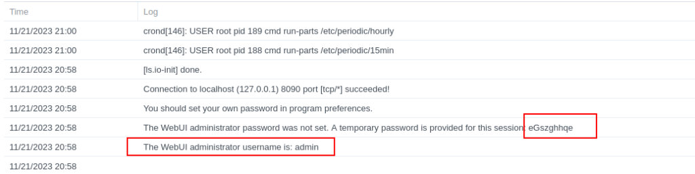

### Change username and password

The first thing to do now that you are logged in is to change your username and password. Click the cog icon at the top of the page, then go to the Web UI tab. Put in your new details then click save at the bottom of the page.

**NOTE:** Please change both your username and password for maximum security.

### Change downloads path

Go back to settings, then go to the “Downloads” tab.

Change the default save path to “/downloads/complete” and tick the box for “Keep incomplete torrents in:”. Select “/downloads/incomplete”

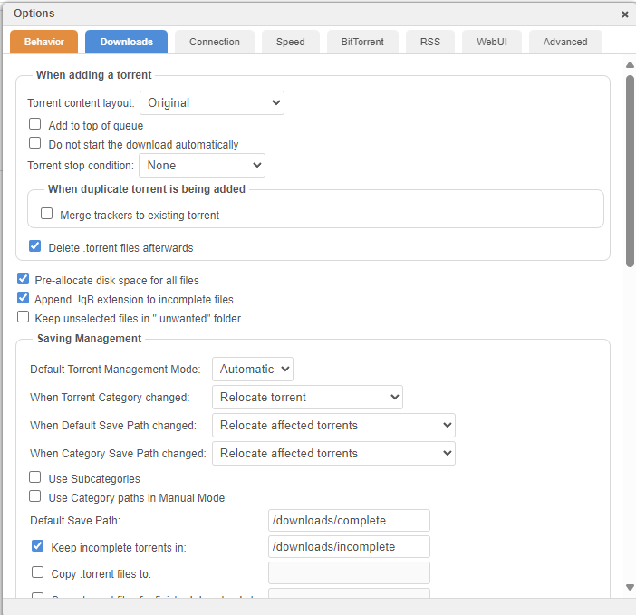

## Radarr

### Adding Authentication method

Open a web browser on your PC, then type in the IP of your NAS followed by port 7878. So e.g. 192.168.0.2:7878. The first time you open this, you will be prompted to add an authentication method. I recommend to use forms and have it enabled. Set username to something else than admin or administrator as this is easy to guess.

### Adding Root Folder

Now go to settings on the left-hand side menu.

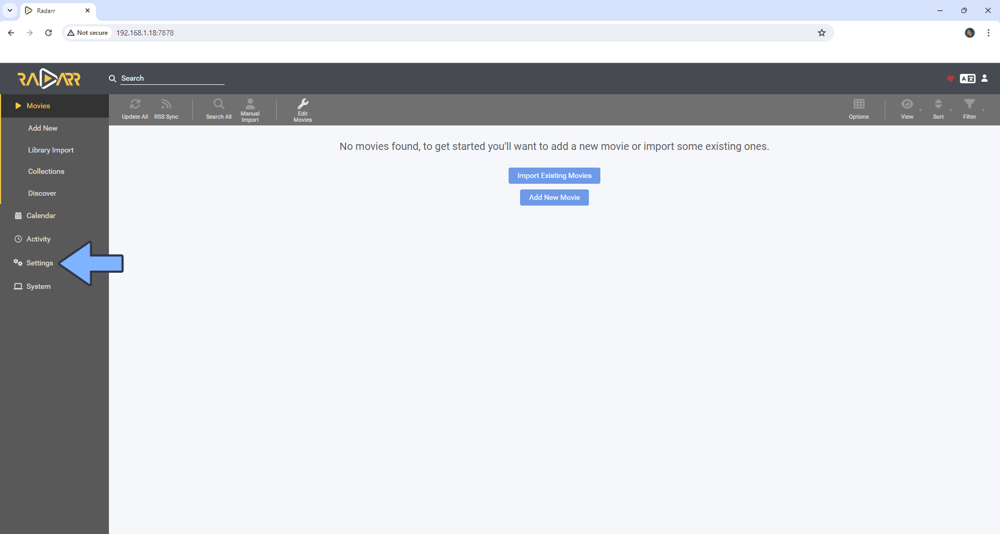

Now go to media management, scroll down and click on “Add Root Folder”. Type /movies/ and select it. If you mounted it as something else in the docker-compose (which you should not have done) then select the appropriate folder. Click OK.

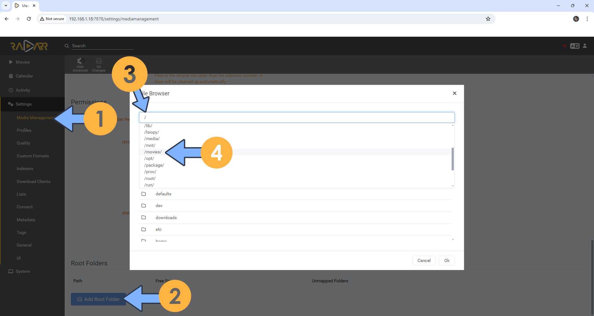

### Changing Movie Naming Scheme

1. Go to settings, then choose media management. Turn on advanced settings (right under the search bar).
2. Tick the box next to “Rename Movies” and “Replace illegal characters.”
3. Change the “Standard Movie Format” to the one that fits you the best on TRaSH’s website. For Plex, I recommend to stick with Plex (TVDB). You can read more about recommended naming schemes here: <https://trash-guides.info/Radarr/Radarr-recommended-naming-scheme/>
4. For Movie Folder Format I would go for “{Movie CleanTitle} ({Release Year}) {tmdb-{TmdbId}}”, but again you can read more on TRaSH Guides.

    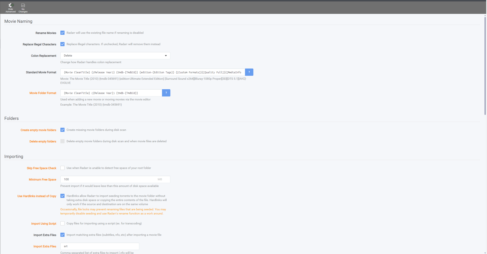

5. Make sure “Use Hardlinks instead of Copy” under “Importing” is enabled.
6. Scroll down until you get to “File Management” and select “Do Not Prefer for” “Propers and Repacks”. This is important for our quality profiles later.

    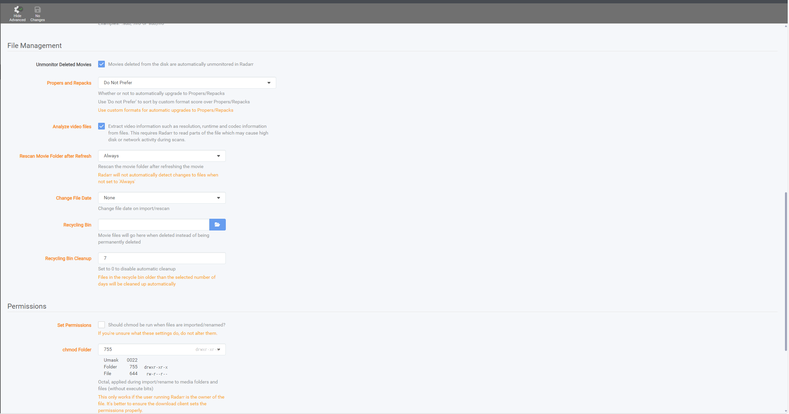

Now be sure to click save, next to the “Show advanced” switch under the search bar.

### Quality Settings (File Size)

1. Go to settings, then select “Quality” from the menu. Make sure to enable “Show Advanced” by clicking the cog under the search bar.
2. Go to TRaSH Guids and change the appropriate settings as described.

    <https://trash-guides.info/Radarr/Radarr-Quality-Settings-File-Size/>

    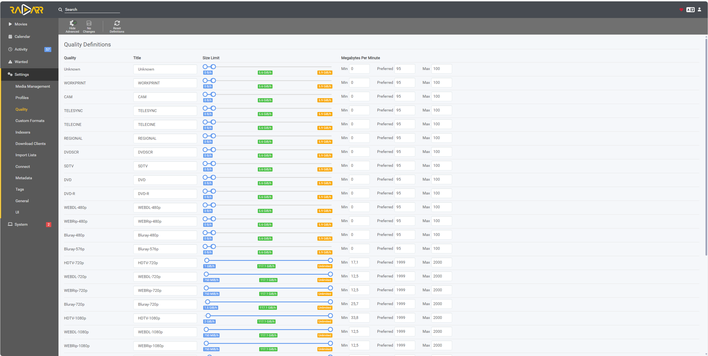

### Quality profiles

1. Go to settings, Profiles.

    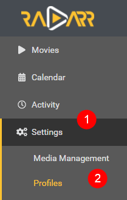

2. Delete all of the default ones.
3. Create a new one
4. Go to TRaSH Guide’s and follow their instructions on how to setup quality profiles, aswell as to set custom formats. Add all the profiles you need for you setup, needs and wants.

    <https://trash-guides.info/Radarr/radarr-setup-quality-profiles/>

## Sonarr

### Adding Root Folder(s)

1. Open a web browser on your PC and type in the IP of your NAS followed by port 8989. So e.g. 192.168.0.2:8989.
2. Here you will be prompted to set up an authentication method. I recommend selecting “Forms” and having it enabled. Choose a username that is not admin or administrator, then select a password.

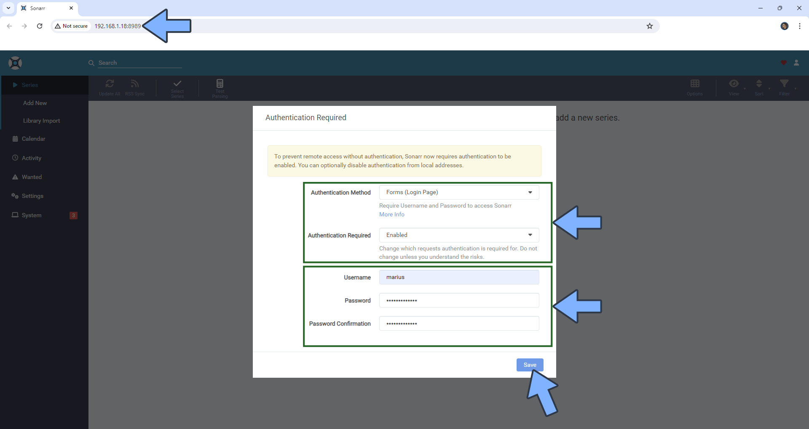

1. Go to settings

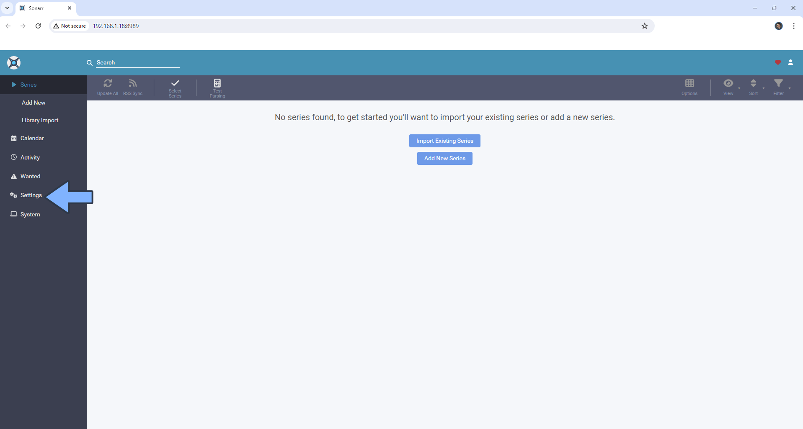

1. Select “Media Management”, scroll down and click on “Add Root Folder”. Type in /tv/ and select it before you click OK. If you have a separate folder for anime, add another root folder and search for /anime/ and select it. Click OK.

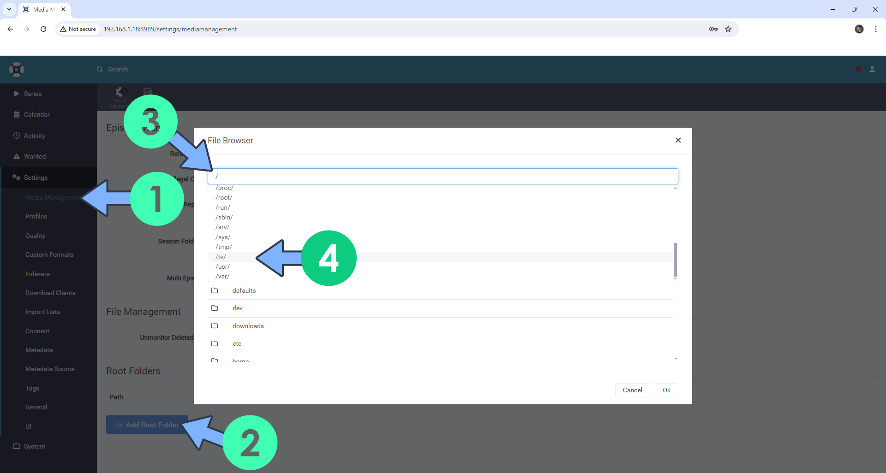

### Changing Naming Scheme(s)

1. Go to settings \> Media Management and click on Show Advanced.

    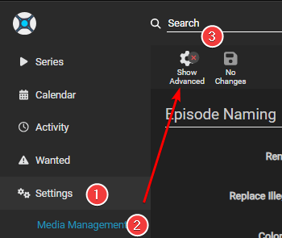

2. Enable “Rename Episodes”. I recommend to also enable “Replace illegal characters”

    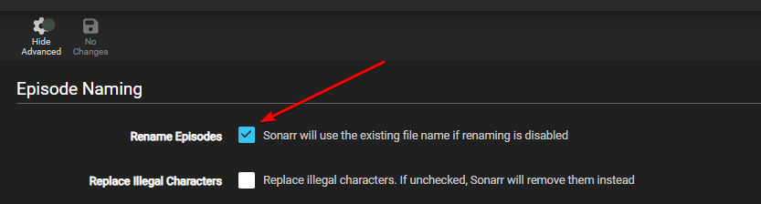

3. Go to TRaSH Guide’s and select the settings they recommend.

    [https://trash-guides.info/Sonarr/Sonarr-recommended-naming-scheme/\#standard](https://trash-guides.info/Sonarr/Sonarr-recommended-naming-scheme/#standard)

4. Scroll down to “File Management” and select “Do not Prefer” for “Propers and Repacks”. This is important for our quality profiles later.
5. Under “Importing” make sure “Use Hardlinks instead of Copy” is enabled.

### Quality Settings (File Size)

1. Go to settings and select “Quality”
2. Enabled “Show Advanced” by clicking the cog at the top.
3. Go to TRaSH Guides and edit the appropriate settings

    <https://trash-guides.info/Sonarr/Sonarr-Quality-Settings-File-Size/>

### Quality Profiles

1. Go to settings and select “Profiles”

    

2. Delete all the default ones.
3. Go to TRaSH Guides and set up profiles as described there. Import the relevant custom formats that fits your needs and wants.

    <https://trash-guides.info/Sonarr/sonarr-setup-quality-profiles/>

### Quality Profiles (Anime)

1. Go to settings and select “Profiles”

    

2. Delete all the default ones.
3. Go to TRaSH Guides and set up profiles as described there. Import the relevant custom formats that fits your needs and wants.

    <https://trash-guides.info/Sonarr/sonarr-setup-quality-profiles-anime/>

## Lidarr

### Adding Root Folder(s)

1. Open a web browser on your PC and type in the IP of your NAS followed by port 8686. So e.g. 192.168.0.2:8686.
2. Here you will be prompted to set up an authentication method. I recommend selecting “Forms” and having it enabled. Choose a username that is not admin or administrator, then select a password.

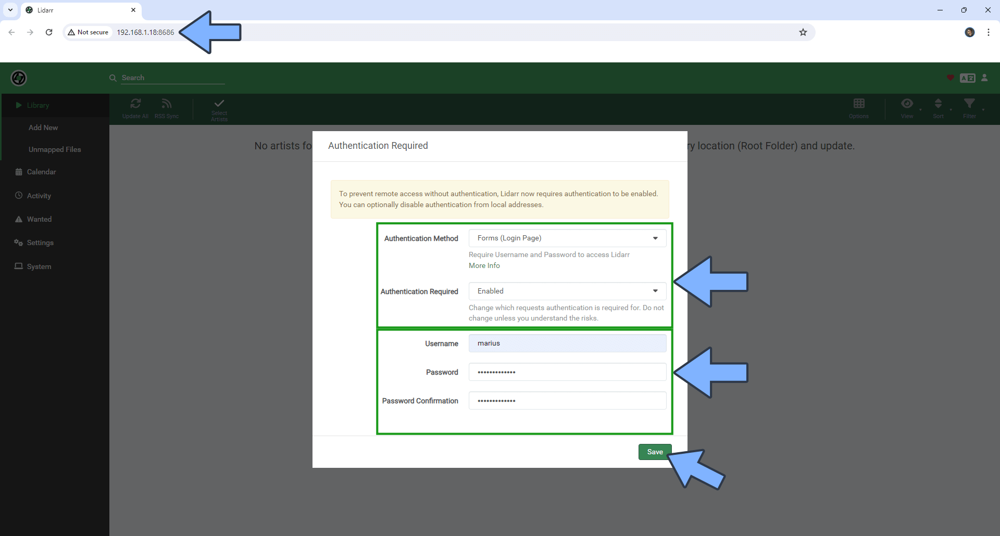

1. Go to settings, then select “Media Management”.
2. Click on the big “+” sign under “Add Root Folder

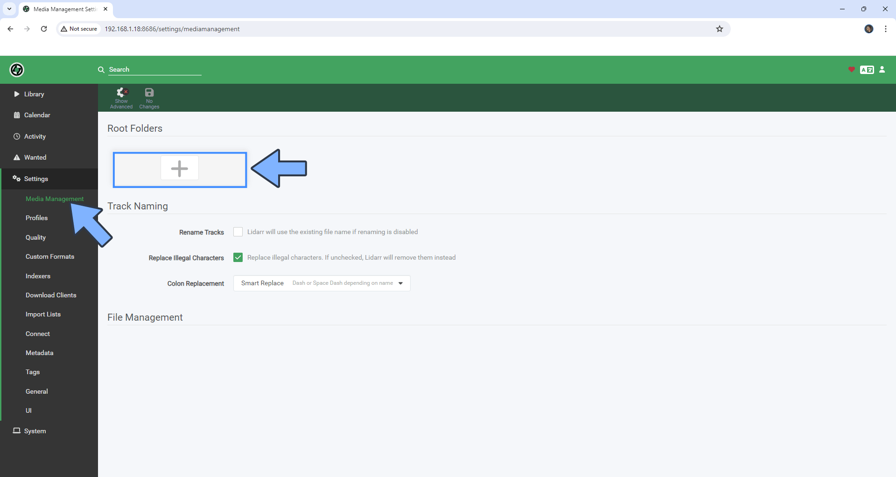

1. Search for “/music/”, select it then click on OK

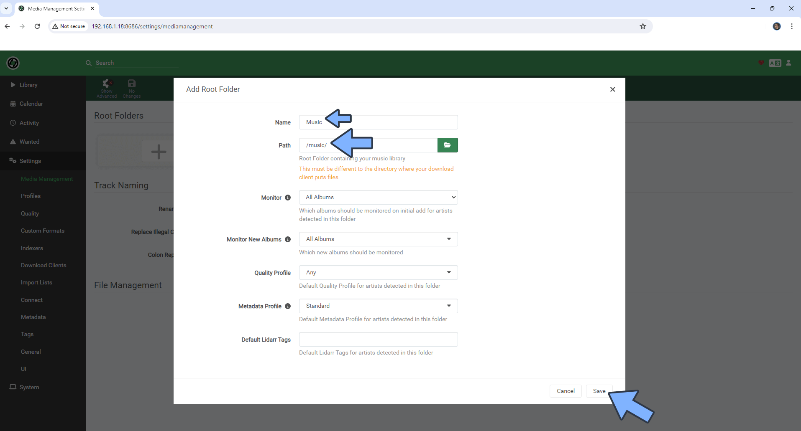

1. Make sure “Rename Tracks” and “Replace illegal characters” is enabled.

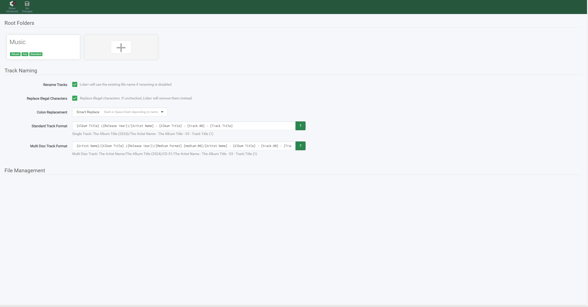

“Standard Track Format” should be:

{Album Title} ({Release Year})/{Artist Name} - {Album Title} - {track:00} - {Track Title}

And “Multi Track Format” should be:

{Artist Name}/{Album Title} ({Release Year})/{Medium Format} {medium:00}/{Artist Name} - {Album Title} - {track:00} - {Track Title}

### Quality Settings

TRaSH Guides have no guides on lidarr. I have tried to search the internet but have not found any guides on quality settings or profiles for lidarr. I have only set up one profile myself on Lidarr, which is a pretty basic one without any scoring system with custom formats. Neither have I changed the size for the different Quality Settings.

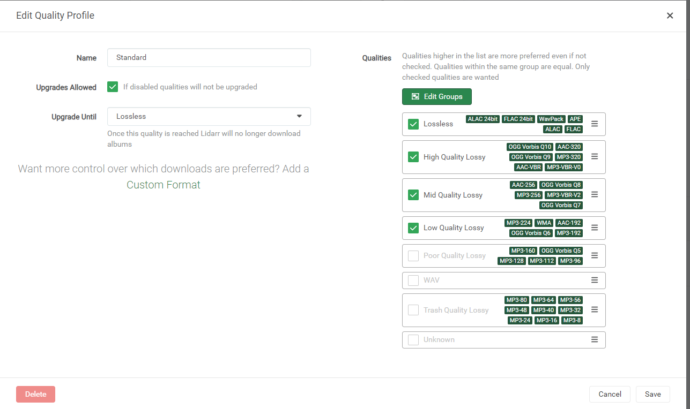

## Connecting download client to Radarr, Sonarr and Lidarr

Now that we have configured all of our main arr-apps, we need to actually give them something to send the downloads to. For this guide we are using qBitTorrent. The setup will be identical for all of the apps, so just repeat the steps for all of them.

1. Go to settings, then select “Download Clients”
2. Make sure “Automatically import completed downloads from download client” is enabled.
3. Click on the big “+” icon.

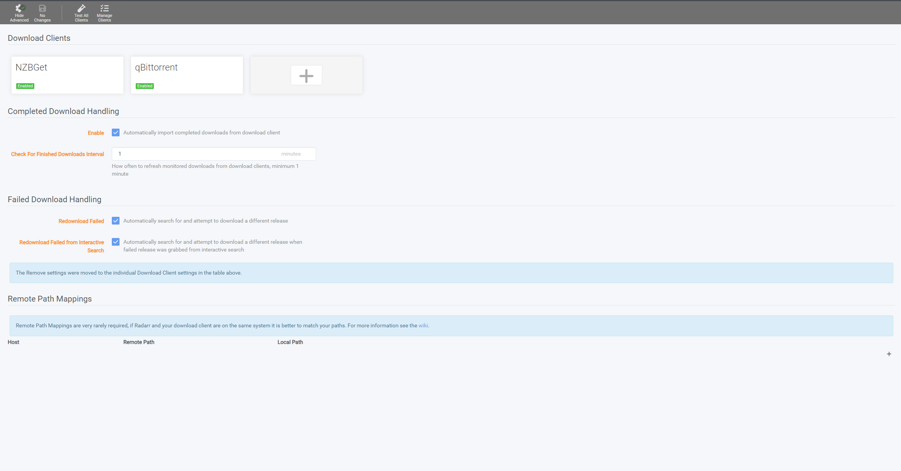

1. Select qBitTorrent
2. Fill out the details

i Name: qBitTorrent

ii Enable

iii Host: 170.20.0.2

**NOTE:** This must be the IP of the **GlueTUN** container, and **NOT** the NAS itself. So instead of 192.168.0.2, we but 172.20.0.2. To confirm this is the correct IP, we can go back to Synology container manager \> container and click on gluetun. Scroll down until you find “Network Settings” and look for where is says “IP Address”

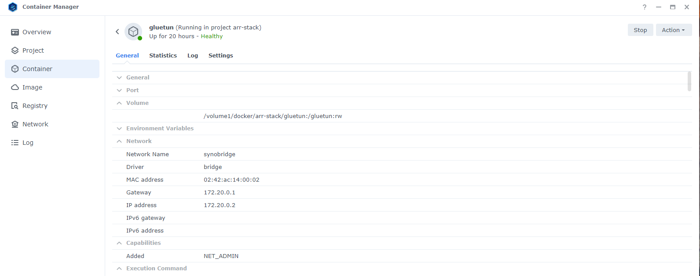

iv Port: 8085

v Username: \<username on qBitTorrent\>

vi Password: \<password on qBitTorrent\>

vii Category: \<the appropriate category. music/movies/tv/anime\>

**NOTE:** For Sonarr, you will need to setup 2 download clients if you want to

separate anime to a separate folder then tv. Both can be the same

client, with identical setup. Only thing that has to change is the

“Category” must be “anime” for anime and “tv” or “series” for

normal TV Series.

1. Click “Test”. If it becomes green for a second, then press “Add” If it becomes red, review and double check your settings.

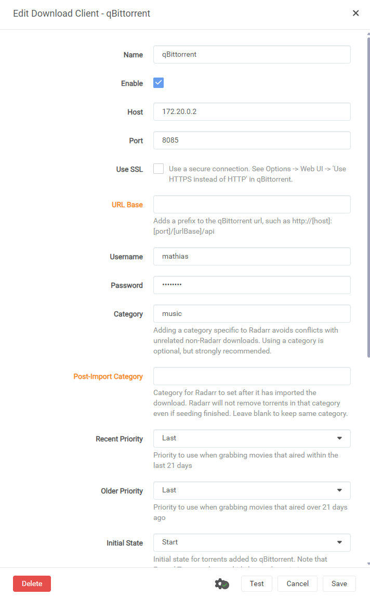

## Prowlarr

### Adding the apps to Prowlarr

Now that we have set up all our downloaders, we need something to actually search for the files we are going to download. For that, we will use Prowlarr.

1. Go to \<NAS-IP\>:9696 e.g. 192.168.0.2:9696
2. Fill out the form just like earlier.

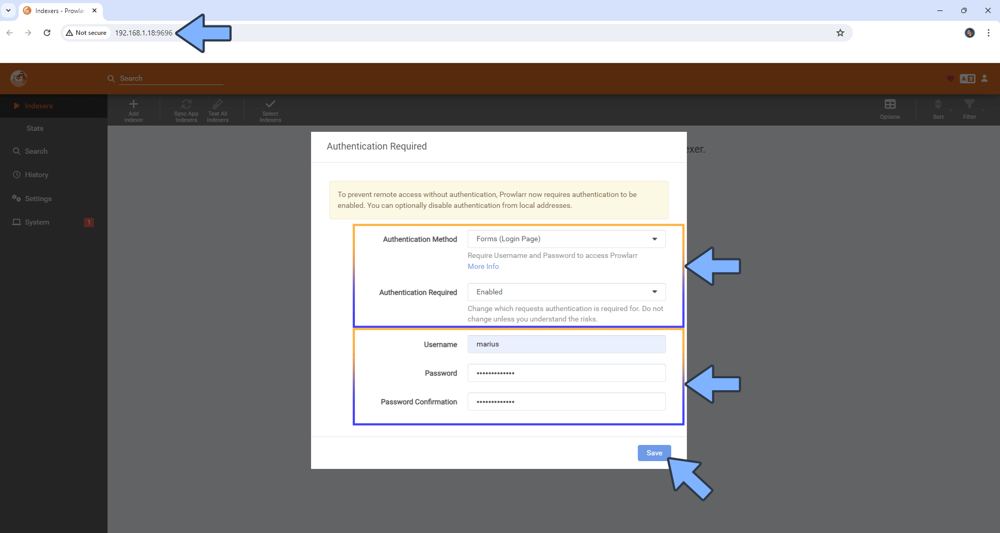

1. Go to settings on the left-hand side menu.

    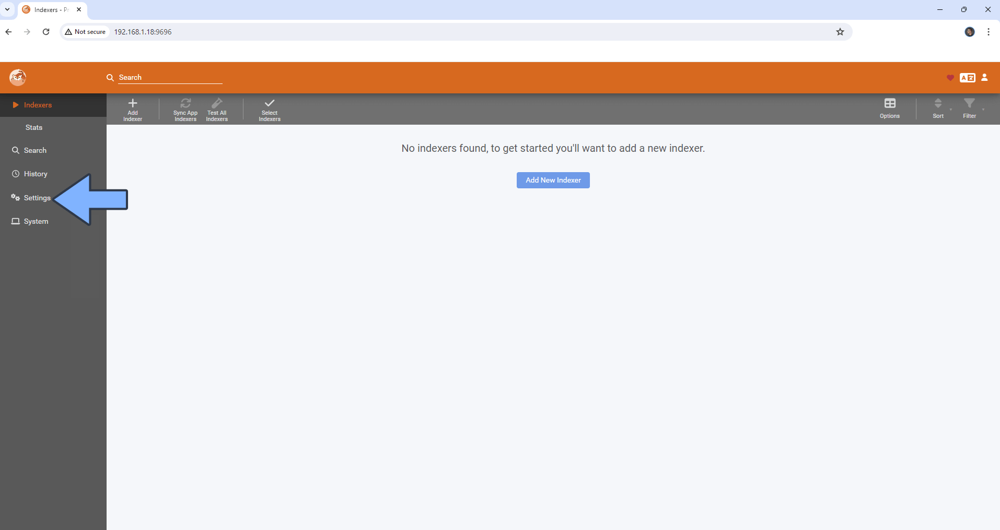

2. Click on apps, then the big “+” under applications

    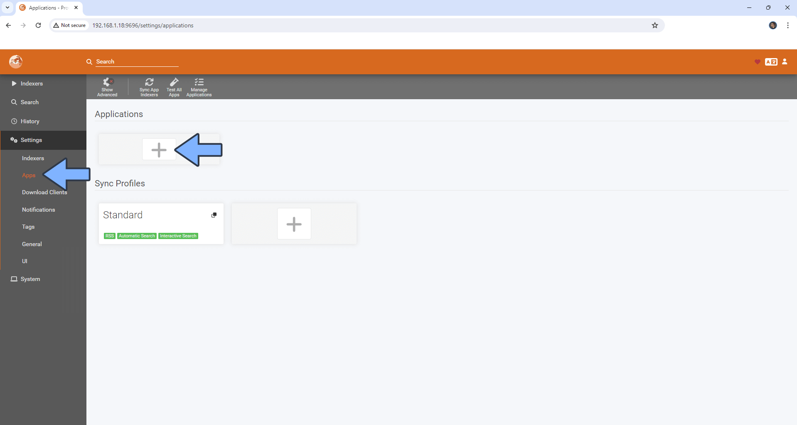

3. Click on the app you want. We can start with Radarr.

    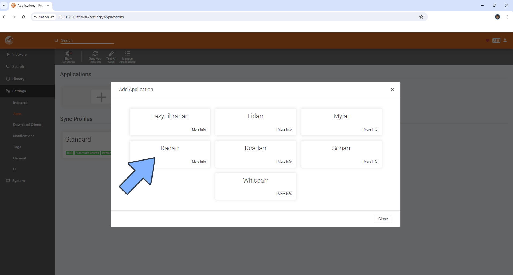

1. Fill out the form:

- Name can be default.
- Sync Level: Full Sync
- Tags: Leave blank
- Prowlarr server: <http://172.20.0.2:9696>
- Radarr server: <http://172.20.0.2:7878>

    **NOTE:** If you chose another IP for your “synobridge” network, then put that in instead.

- API Key: Get this from the relevant app. In this case, Radarr. Scroll down to find out how.

1. Repeat this step for all the apps you want; LazyLibrarian, Lidarr, Mylar, Radarr, Readarr, Sonarr and Whisparr.

    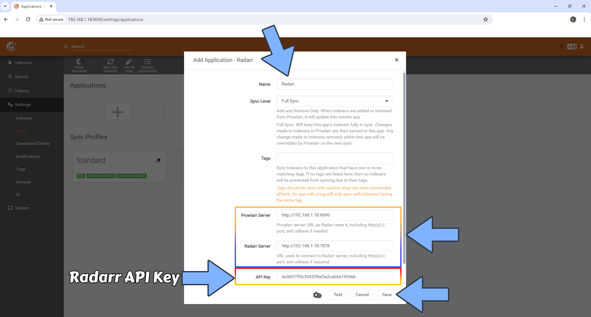

### How do I get the API key?

1. Open your relevant application in the browser.
2. Go to settings, then click on “General”
3. The API Key should be right there. Just click the copy button on the right, and paste that into Prowlarr.

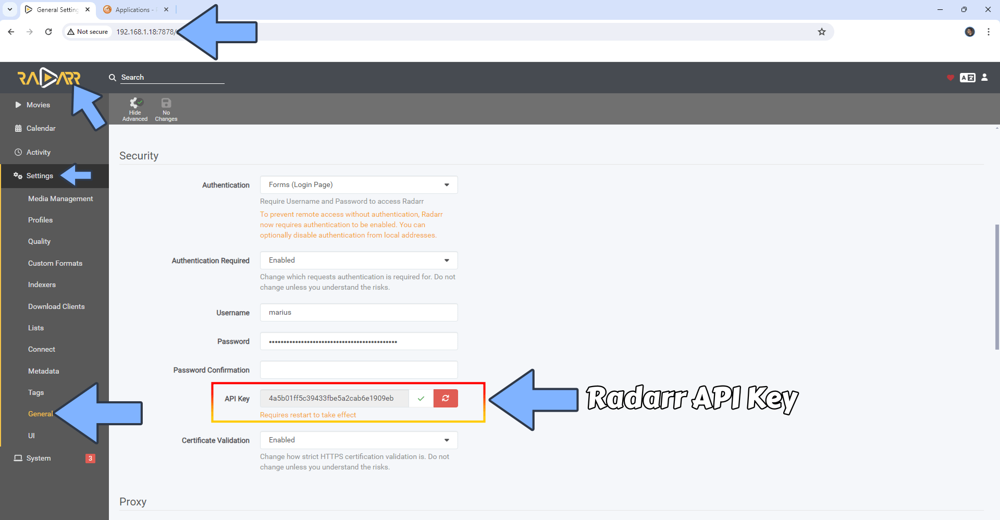

### Connecting Flaresolverr

Some indexers, like 1337x which is one of the best free ones, require you to solve a Cloudflare verification before you get access. To make prowlarr do this, you have to use flaresolverr. To do this:

1. Go to settings, then click on indexers
2. Click the big + icon.

    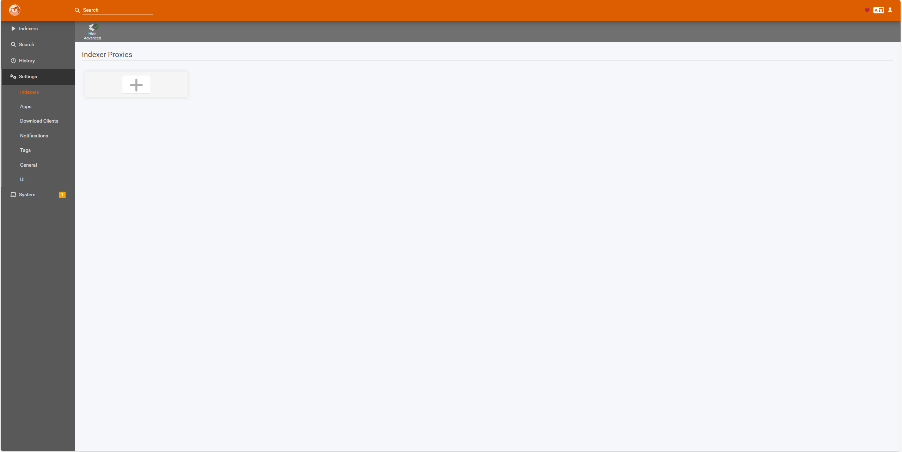

3. Edit the “Host” field to be “<http://172.20.0.2:8191”>

    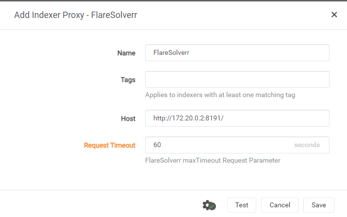

4. Click on “Test” and if it becomes green for a second it works, and you can click “Save”. If it becomes red, then double check your Host IP. It should be the same as your “synobridge” network in docker.

    

### Adding indexers

Indexers are the websites prowlarr search for files. Sadly, a lot of the good ones are pirvate. This means that to use them you will most likely need to pay to get access, so I will focus on the free ones.

1. Click on Indexers, then “Add Indexer”

    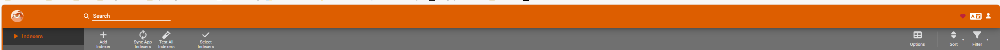

2. Here can filter by protocol, Language, Privacy and Category. All indexers that use the “nzb” protocol are private. So you could just set the privacy to public to get a list of all the free ones. The 2 ones I would recommend to get at least are 1337x and TheRARBG for general TV and movies, and Nyaa for anime.
3. We can now search for our desired indexers, then click on the result
4. Fill out the settings. Base URL should be 1337x.to and I would also recommend to tur non advanced settings, then choose “minimum seeders: 1”.

    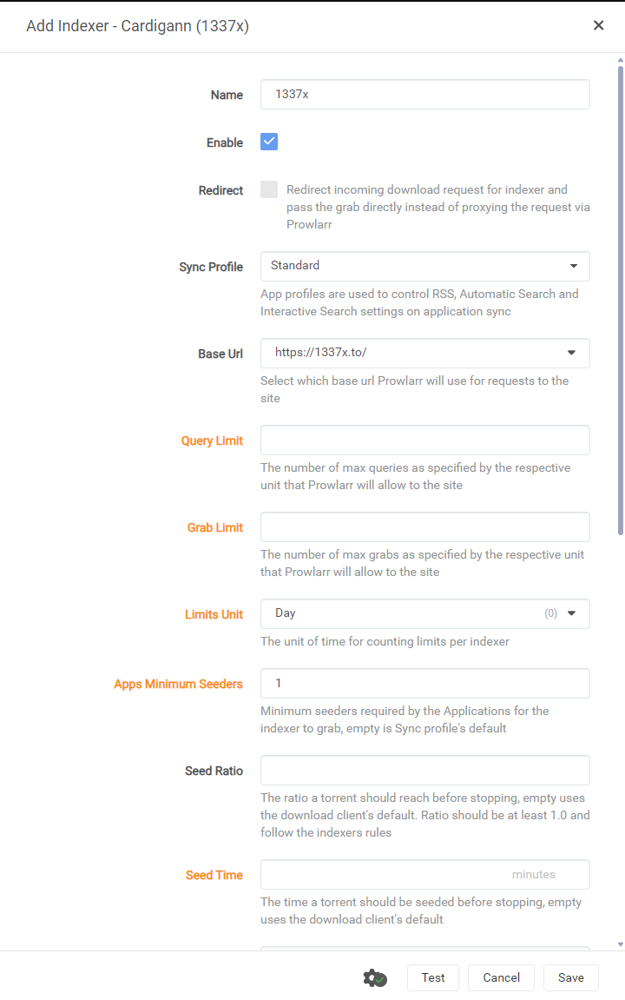

    If we scroll down, we can see that it says it requires flaresolverr. Now we can click “Test” to see if it works, and if it does we can click “Save”. Do this for all your wanted indexers.

    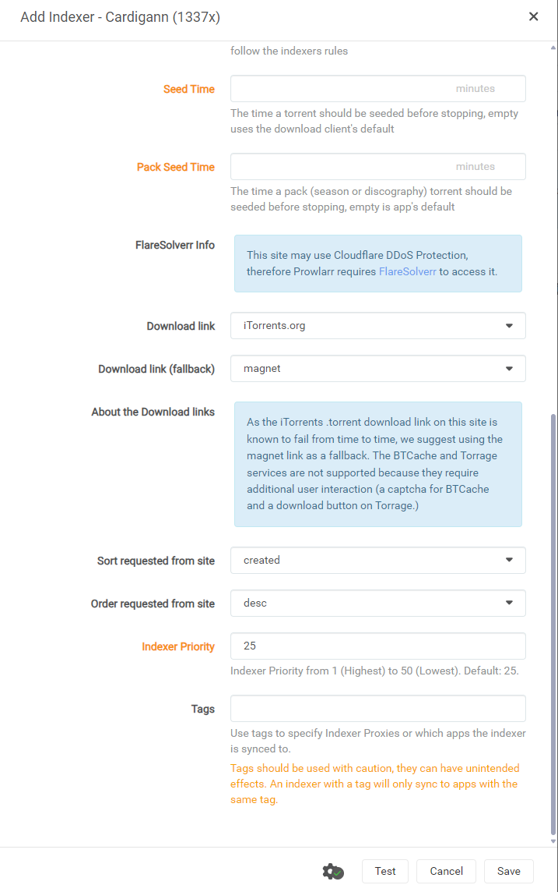

5. After you have added all your desired indexers, click on “Sync App Indexers” to push them to all your apps.

    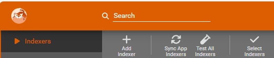

6. Let’s wait 2-5 minutes for it to finish up, then we can head into our apps, like Radarr or Sonarr, and click on settings \> indexers to see our selected indexers with a (prowlarr) at the end to indicate where it comes from.

    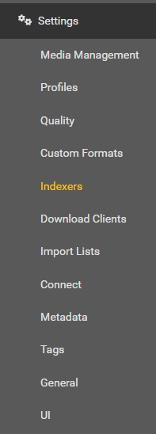

    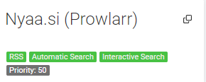

## Overseerr

Now it’s time to take the automation to the next level. With overseer, we get a huge catalogue of movies and shows at our fingertips, and can download them with just one click.

### Configuring Overseerr

1. Go to \<synolog-ip\>:5055.
2. Click “Sign In”, and follow the sign in instructions

    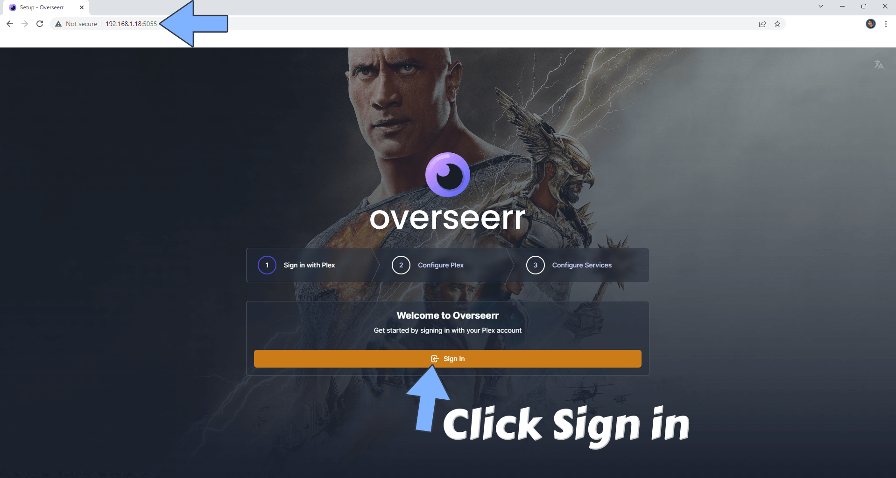

3. On the setup screen, **DON’T** use your NAS IP, but your synobridge IP. So for me it’s 172.20.0.2. If you haven’t changed the plex port, it can stay as default. Click “Save Changes”. You should now see a green checkmark at the top.

    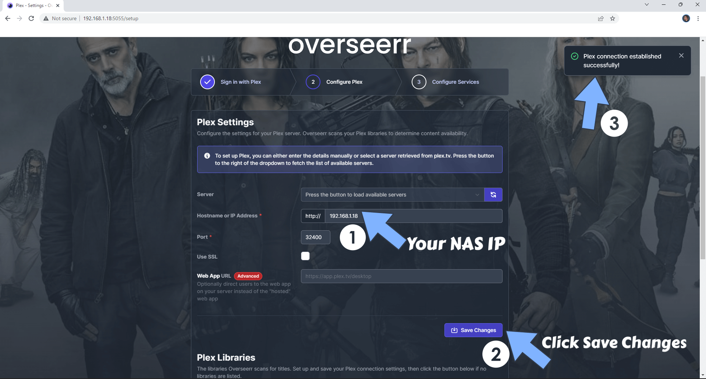

4. Scroll down a bit and click “Sync Libraries”. Afterwards you can click continue. If it’s not done syncing, it will continue in the background.

    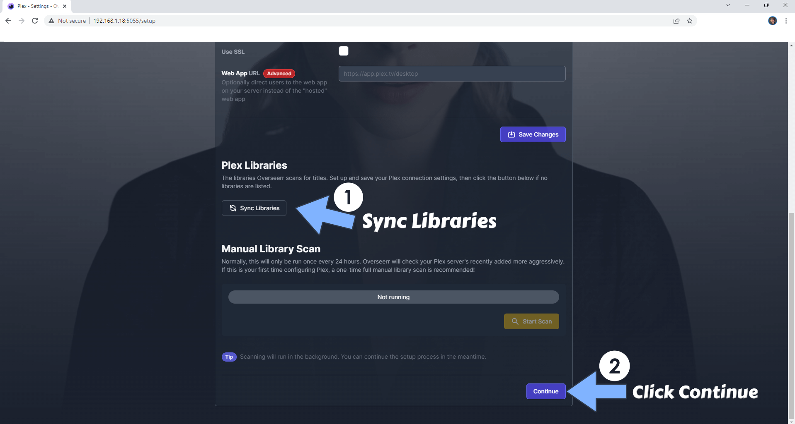

5. Add your Radarr and Sonarr by clicking the buttons as shown in the image below. Scroll down to continue.

    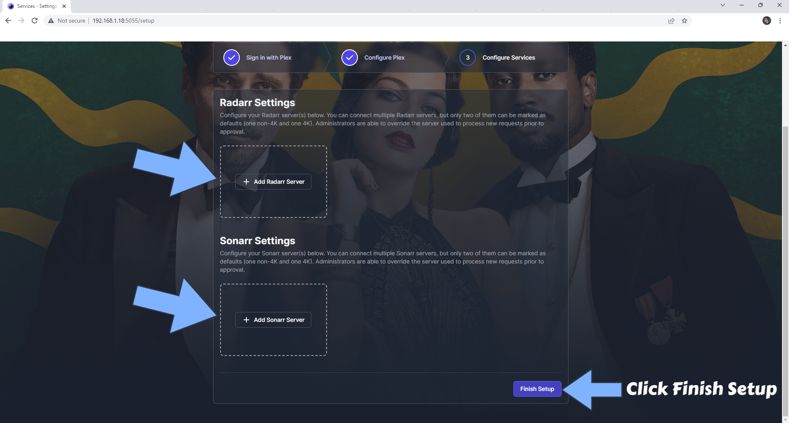

### Adding Radarr and Sonarr

On the first-time setup, you will get a prompt to add Radarr and Sonarr. If you manage to miss it, freight not as you can do it in settings later. Just head to settings \> services then click on add.

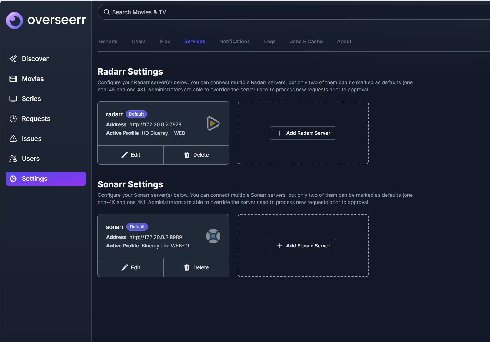

#### Radarr

1. When you click on “Add Radarr Server” you should see something like this:

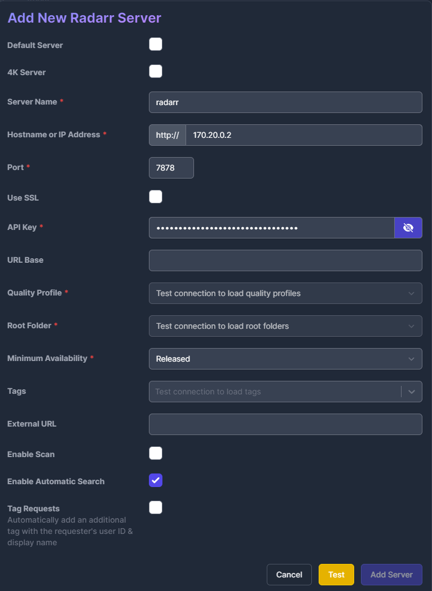

1. Fill out server name, hostname, port and API Key as follows:

- Server Name radar (or anything you like)
- Hostname: 170.20.0.2 (your synobridge IP)
- Port: Default. 7878 for Radar
- API Key: Your relevant API Key. Don’t know how to get it? Check the table of contents.

1. Now click on “Test”. If it’s successful, you will now get to select the rest of the settings.
2. Now configure the rest of the settings:

- Quality Profile: Your desired default quality profile. This can be changed every time you request in Overseer, but not in Requestrr
- Root folder: /movies
- Minimum availability: Whatever you prefer. I want it to be released.
- Tick the options for “Enable scan” and “Enable Automatic Search”

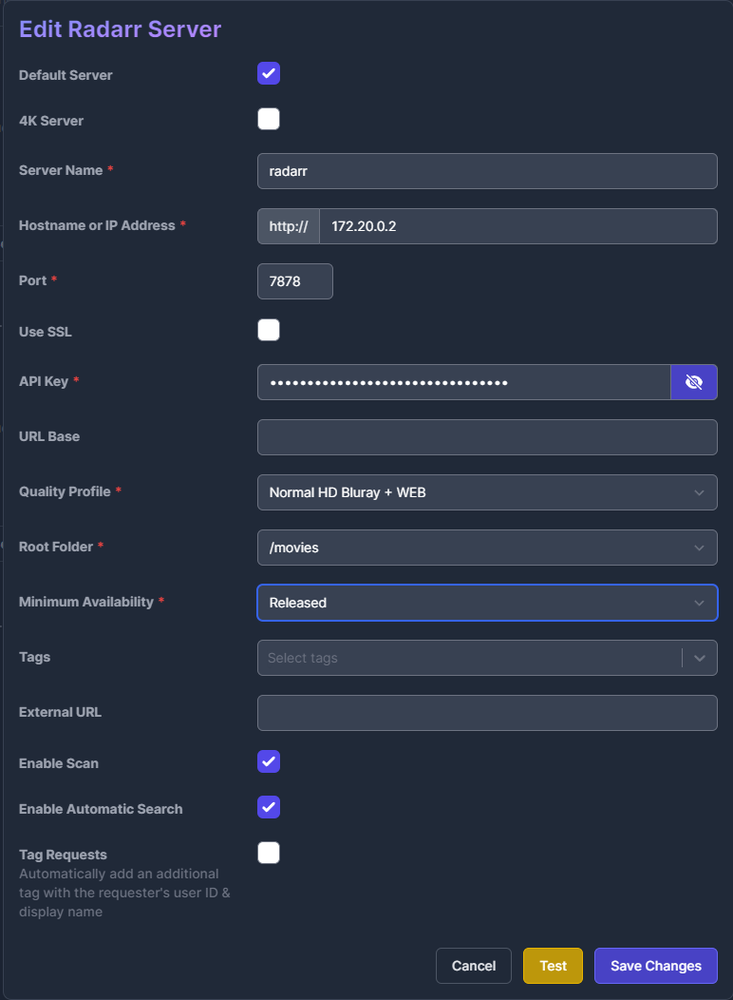

1. Now we can save our changes.

#### Sonarr

1. After you click “Add Sonarr”, you should see something like this:

    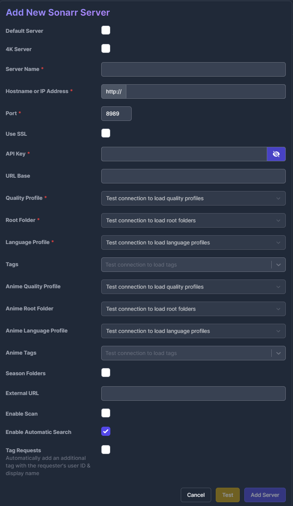

2. Fill out the settings like this:

- Servername: sonar (or anything you like)
- Hostname: 170.20.0.2 (Your synobridge IP)
- Port: Default. 8989 for Sonarr
- API Key: Your API Key. Don’t know where to get it? Check the table of contents.

1. Now we can click “Test” to test out connection. If it’s successful, we can now move on to edit some more settings.

    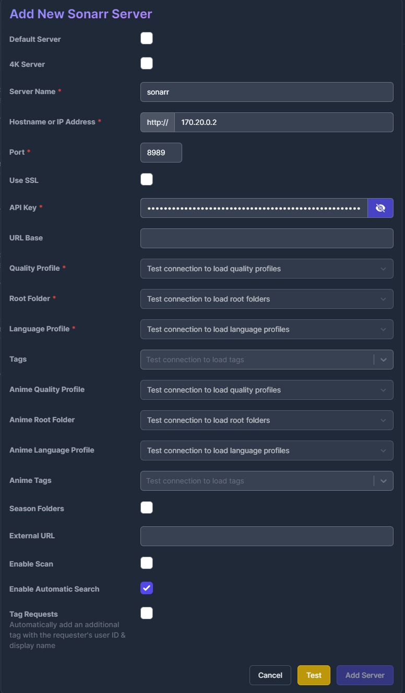

2. Now make these changes to the settings:

- Quality Profile: Your desired default quality profile. This can be changed every time you request in Overseer, but not in Requestrr
- Root Folder: /tv
- Language Profile: Depricated
- Tags: series
- Anime Quality profile: Your desired default quality profile for anime shows. This can be changed every time you request in Overseer, but not in Requestrr
- Anime Root Folder: /anime
- Language Profile: Depricated
- Anime Tags: anime
- Be sure to tick the boxes for “Enable Scan” and “Enable Automatic Search”

1. Click “Save”

    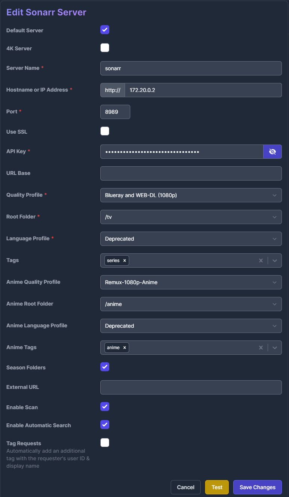

### Requestrr

Now we can configure Requestrr. It allows us, and our users, to request movies and TV shows through chat in discord. This is a good alternative if you don’t know how or don’t want to port forward your Overseer. Or if you plan to share your Plex with strangers and don’t want them to know your public IP-address

#### Configuring Requestrr

1. Open Requestrr in a web browser by typing \<NAS-IP\>:4045
2. The first time you log in, you might get a pop-up to create an authentication method just like all the other apps. Fill out the form like earlier then.
3. When we open up Requestrr, we should see our Chat clients. If not, navigate to it on the left-hand side menu.

    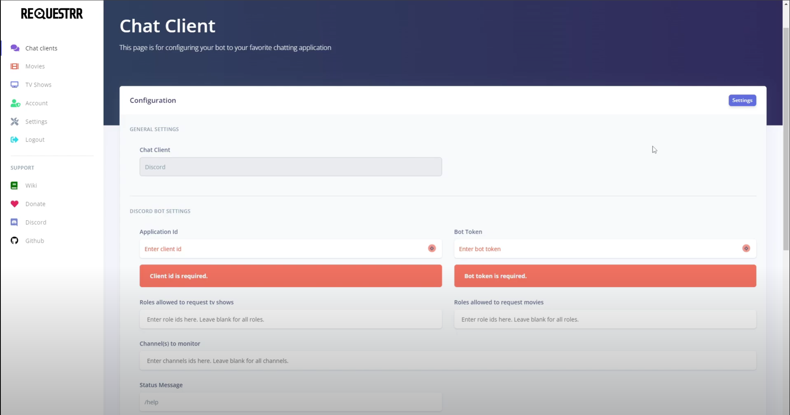

4. As you can see, we need an Application Id and Bot Token for Discord. Here is how you can get it:

#### How to get Discord Application Id and Bot Token

1. Go to Discord Developer Portal by clicking this link: <https://discordapp.com/developers/applications>
2. Click on New Application

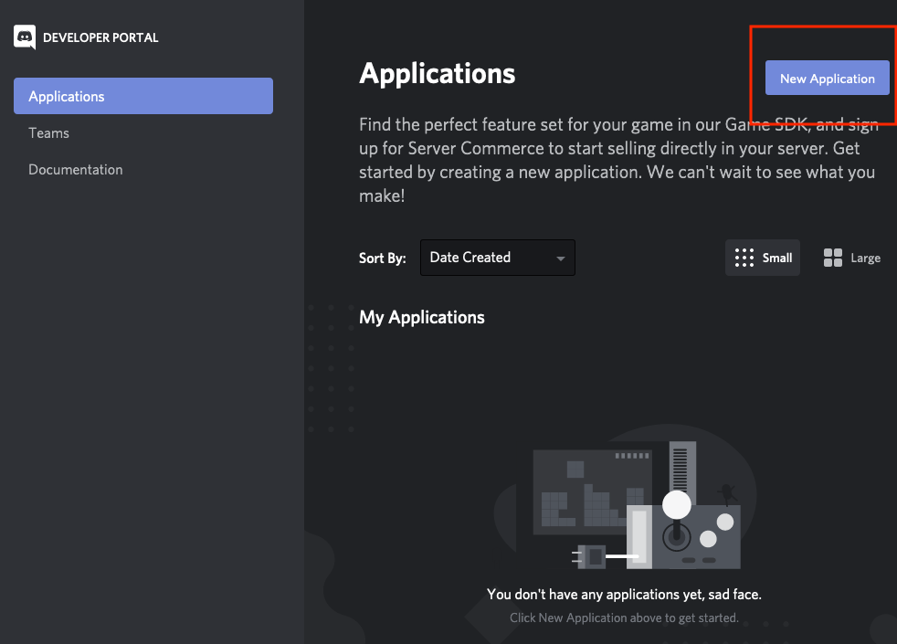

1. Give it a name and a profile picture if you so wish. The important thing is to copy the Application Id.

    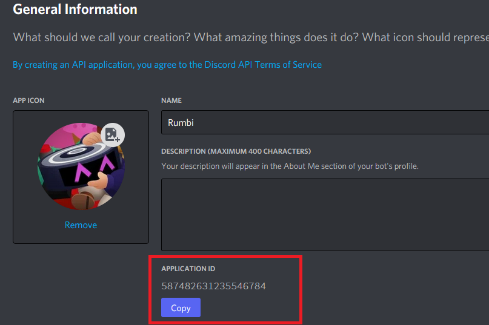

2. Paste it into Requestrr

    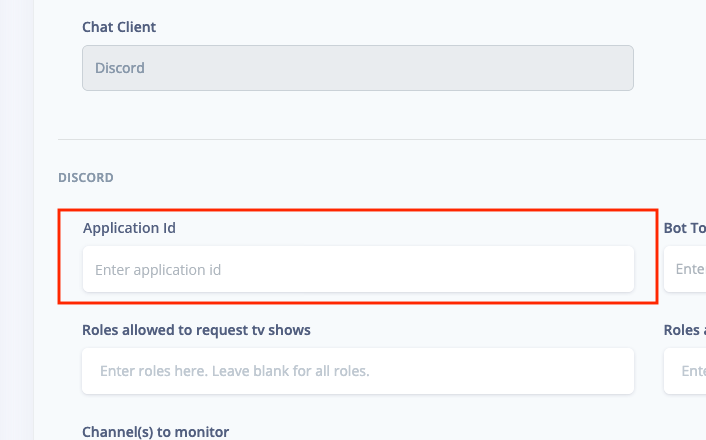

3. Go back into Discord Developer Portal and create a bot for your newly created application.

    

4. Make sure these 2 settings are enabled:

    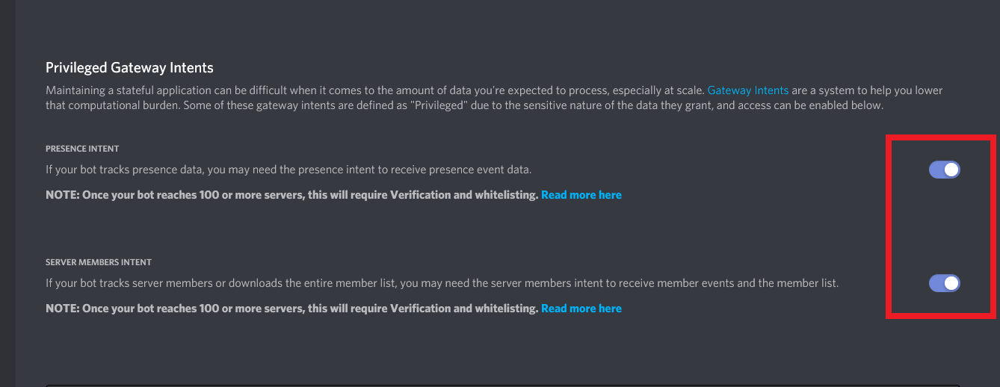

5. Now copy the Bot Token

    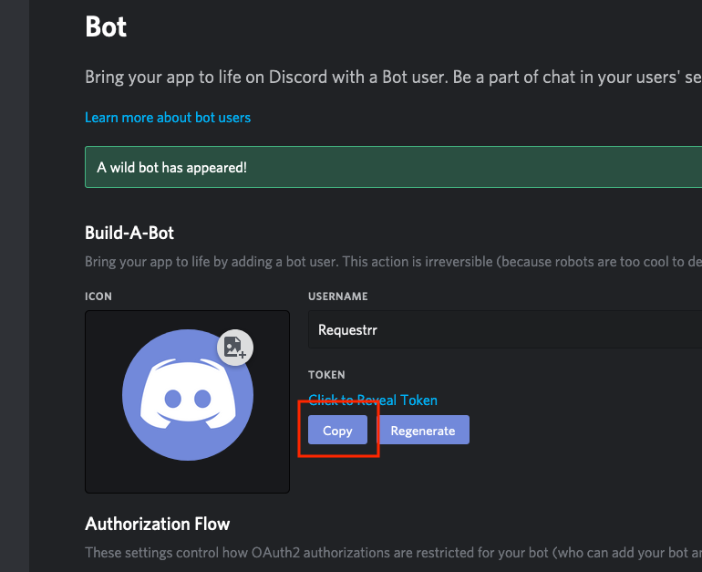

6. Paste the Bot Token into Requestrr

    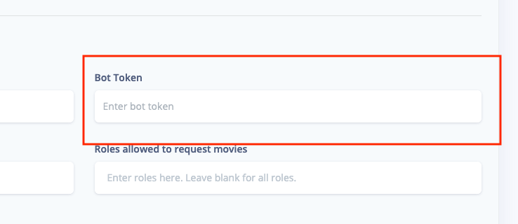

7. Click on “Test Settings” to check if the connection is good

    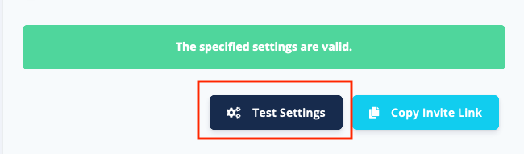

8. Go to your discord server, right click on the channel you want your bot to be in and copy the channel ID. Paste it into “Channel(s) to send notifications to”

    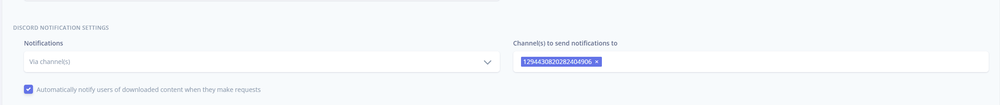

9. Finally, we can save our changes

    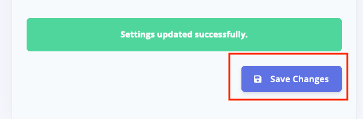

#### How to invite the bot to our Discord server

1. Be sure you have created a Discord server, or are admin in an existing one
2. Click “Copy Invite Link”

    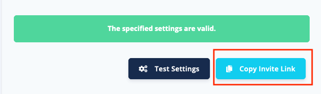

3. Choose the Server you whish to add the Bot to

    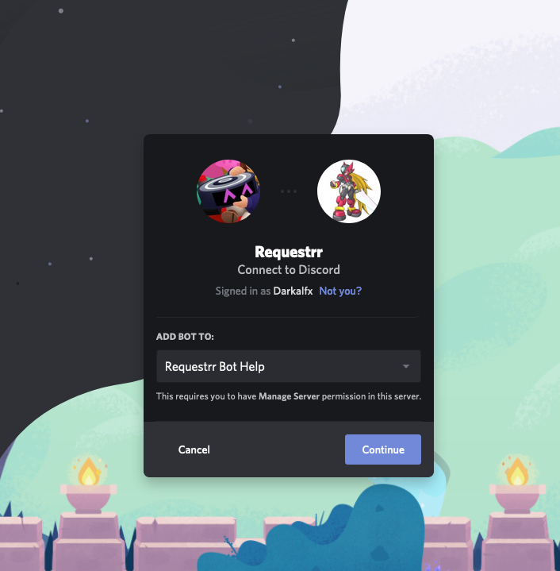

#### Connecting Requestrr to Overseerr (Or Radarr, Sonarr, Ombi)

Now we have to set up Requestrr to actually, well, request. The best way would be to use Overseer or Ombi, but it also works directly with Radarr and Sonarr.

1. Go to Overseer on your web-browser. \<NAS-IP\>:5055
2. Go to settings (On the left-hand side menu) and make sure “Enable CSRF Protection” is disabled (unticked)
3. While you’re here, also copy your Overseer API key.

    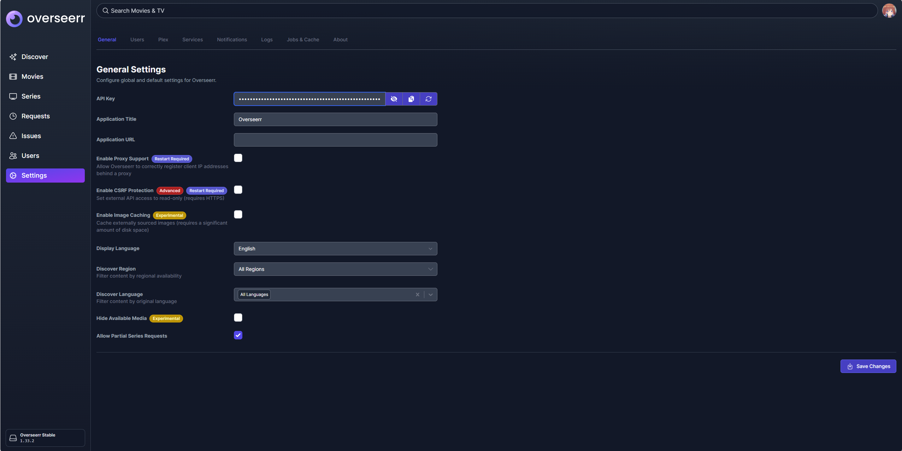

4. Go to Requestrr on your web-browser. \<NAS-IP\>:4045
5. Go to Movies (On the left-hand side menu)

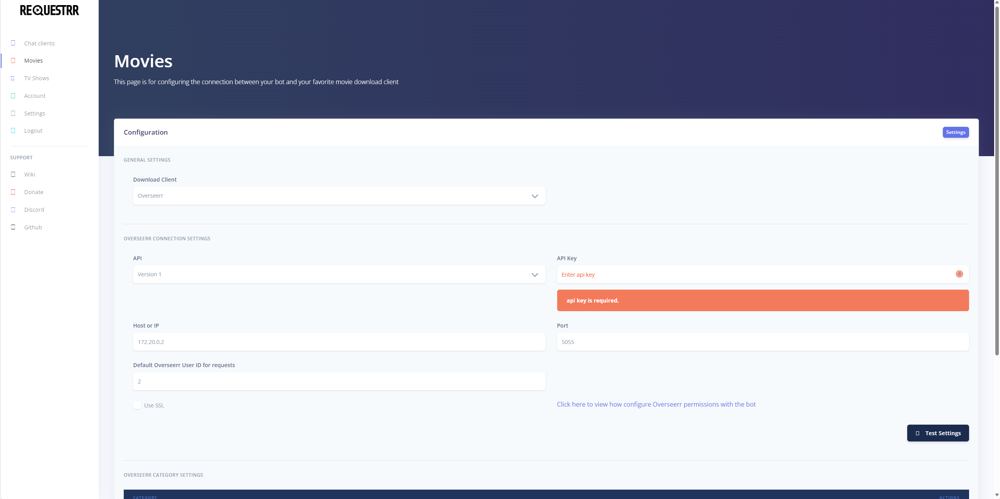

1. Choose Overseer as Download Client. Paste in your API Key. Host should be 170.20.0.2 (your synobridge) and port 5055.Default Overseer user is which user the requests should come from. To find out your user ID to as follows:

    i Go back to overseer

    ii Select “Users” from the menu

    iii Then you should see a list of all your users. I made a custom Requestrr user.

    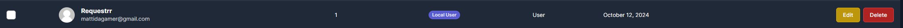

    Click on the desired user. Now you should see your user id

    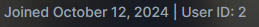

2. Click “Test Settings”, then scroll down and click on “Save Changes”
3. Now go to “TV Shows” from the menu, and do the exact same as you did for movies. Most of it should already be automatically filled out by your movies section when you select “Overseerr” as client.
4. Now it works! You can go to your server and type /help in the channel you copied the ID for earlier, and it will list all available commands.

# TL;DR

If you don’t want to read all that, just do this:

1. Create these folder inside /volume1/docker/arr-stack:

- gluetun
- lidarr \> config
- overseer \> config
- prowlarr \> config
- qbittorrent \> config, downloads
- radarr \>config
- requestrr \> config
- sonar \> config

1. SSH into your NAS and type these commands

- sudo chmod -R 777 /volume1/docker/arr-stack
- sudo chmod -R 777 /volume1/Media
- sudo chown -R \< UID\>:\< GID\> \\volume1\\docker\\arr-stack
- sudo chown -R \< UID\>:\< GID\> \\volume1\\Media
- id

Take note of GID and UID output from id command.

1. Go to Task Scheduler and create a trigger task on start-up to run this script:
2. \#!/bin/sh -e
3.  
4. insmod /lib/modules/tun.ko
5. Create a firewall rule to allow port 1194 and 1195
6. Go to think link: <https://www.blackvoid.club/wireguard-spk-for-your-synology-nas/>. Find the correct version for your system and manually install the .spk file in package cener. Don’t run when finished. Reboot afterwards
7. SSH into your device and type this command:
8. /var/packages/WireGuard/scripts/start
9. Find out how to configure GlueTUN for your VPN provider:

    <https://github.com/qdm12/gluetun-wiki/tree/main/setup/providers>

10. Create a new network inside container manager:

    Configure the network like this:

- Subnet: 172.20.0.0/16
- IP range: 172.20.0.2/25
- Gateway: 172.20.0.1
- IPv6: Disabled
- IP Masquerade: enabled (Leave the “disable” option unticked)

1. Create a new docker project. Path should be /volume1/docker/arr-stack. Paste this docker-compose.yml wand make necessary changes:
2. version: "3"
3. services:
4. gluetun:
5. image: qmcgaw/gluetun
6. container_name: gluetun
7. hostname: gluetun
8. cap_add:
9. \- NET_ADMIN
10. devices:
11. \- /dev/net/tun:/dev/net/tun
12. ports:
13. \- 6881:6881
14. \- 6881:6881/udp
15. \- 8085:8085 \# qbittorrent
16. \- 8989:8989 \# Sonarr
17. \- 9696:9696 \# Prowlarr
18. \- 7878:7878 \# Radarr
19. \- 8686:8686 \#Lidarr
20. \- 8191:8191 \#FlareSolverr
21. \- 5055:5055 \#Overseerr
22. \- 4545:4545 \#Requestrr
23.
24. volumes:
25. \- \\volume1\\docker\\arr-stack\\gluetun:/gluetun
26. environment:
27. \- VPN_SERVICE_PROVIDER=mullvad
28. \- VPN_TYPE=wireguard
29. \- VPN_DISABLE_IPV6=true
30. \# OpenVPN:
31. \# - OPENVPN_USER=
32. \# - OPENVPN_PASSWORD=
33. \# Wireguard:
34. \- WIREGUARD_PRIVATE_KEY= iExD5V5kkXnh+40dyo/PmCL1aus8eNBdHQMWergYFWo=
35. \- WIREGUARD_ADDRESSES=10.72.171.113/32
36. \- DNS=10.64.0.
37. \- SERVER_HOSTNAMES=se-sto-wg-001,se-sto-wg-002,se-sto-wg-003,se-sto-wg-004
38. \- SERVER_CITIES=stockholm
39. \- HTTPPROXY=off \#change to on if you wish to enable
40. \- SHADOWSOCKS=off \#change to on if you wish to enable
41. \# Timezone for accurate log times
42. \- TZ=Europe/Oslo
43. \# Server list updater
44. \# See <https://github.com/qdm12/gluetun-wiki/blob/main/setup/servers.md\#update-the-vpn-servers-list>
45. \- UPDATER_PERIOD=24h
46. \- FIREWALL_OUTBOUND_SUBNETS=172.20.0.0/192.168.0.0/24 \#change this in line with your subnet see note on guide
47. \# - FIREWALL_VPN_INPUT_PORTS=12345 \#uncomment or remove this line based on the notes below
48. network_mode: synobridge
49. labels:
50. \- com.centurylinklabs.watchtower.enable=false
51. security_opt:
52.
53. qbittorrent:
54. image: lscr.io/linuxserver/qbittorrent
55. container_name: qbittorrent
56. network_mode: "service:gluetun"
57. environment:
58. \- PUID=1026
59. \- PGID=100
60. \- TZ=Europe/Oslo
61. \- WEBUI_PORT=8085
62. \- UMASK=022
63. volumes:
64. \- /volume1/docker/arr-stack/qbittorrent/config:/config
65. \- /volume1/docker/arr-stack/qbittorrent/downloads:/downloads
66. \- /volume1/Media:/media
67. depends_on:
68. gluetun:
69. condition: service_healthy
70. security_opt:
71. \- no-new-privileges:true
72. restart: always
73.
74. sonarr:
75. image: lscr.io/linuxserver/sonarr:latest
76. container_name: sonarr
77. network_mode: "service:gluetun"
78. environment:
79. \- PUID=1026
80. \- PGID=100
81. \- TZ=Europe/Oslo
82. volumes:
83. \- /volume1/docker/arr-stack/sonarr/config:/config
84. \- /volume1/Media/TV Shows:/tv
85. \- /volume1/Media/Anime TV Shows:/anime
86. \- /volume1/docker/arr-stack/qbittorrent/downloads:/downloads
87. depends_on:
88. gluetun:
89. condition: service_healthy
90. restart: unless-stopped
91.
92. prowlarr:
93. image: lscr.io/linuxserver/prowlarr:latest
94. container_name: prowlarr
95. network_mode: "service:gluetun"
96. environment:
97. \- PUID=1026
98. \- PGID=100
99. \- TZ=Europe/Oslo
100. volumes:
101. \- /volume1/docker/arr-stack/prowlarr/config:/config
102. depends_on:
103. gluetun:
104. condition: service_healthy
105. restart: unless-stopped
106.
107. radarr:
108. image: lscr.io/linuxserver/radarr:latest
109. container_name: radarr
110. network_mode: "service:gluetun"
111. environment:
112. \- PUID=1026
113. \- PGID=100
114. \- TZ=Europe/Oslo
115. volumes:
116. \- /volume1/docker/arr-stack/radarr/config:/config
117. \- /volume1/Media/Movies:/movies
118. \- /volume1/docker/arr-stack/qbittorrent/downloads:/downloads
119. depends_on:
120. gluetun:
121. condition: service_healthy
122. restart: unless-stopped
123.
124. lidarr:
125. image: lscr.io/linuxserver/lidarr:latest
126. container_name: lidarr
127. network_mode: "service:gluetun"
128. environment:
129. \- PUID=1026
130. \- PGID=100
131. \- TZ=Europe/Oslo
132. volumes:
133. \- /volume1/docker/arr-stack/lidarr/config:/config
134. \- /volume1/Media/Music:/Music
135. \- /volume1/docker/arr-stack/qbittorrent/downloads/:/downloads
136. depends_on:
137. gluetun:
138. condition: service_healthy
139. restart: unless-stopped
140.
141. flaresolverr:
142. image: ghcr.io/flaresolverr/flaresolverr:latest
143. container_name: flaresolverr
144. network_mode: "service:gluetun"
145. environment:
146. \- TZ=Europe/Oslo
147. depends_on:
148. gluetun:
149. condition: service_healthy
150. security_opt:
151. \- no-new-privileges:true
152. restart: unless-stopped
153.
154. overseerr:
155. image: sctx/overseerr:latest
156. container_name: overseerr
157. network_mode: "service:gluetun"
158. environment:
159. \- LOG_LEVEL=debug
160. \- TZ=Europe/Oslo
161. volumes:
162. \- /volume1/docker/arr-stack/overseer/config:/app/config
163. depends_on:
164. gluetun:
165. condition: service_healthy
166. restart: unless-stopped
167.
168. requestrr:
169. image: darkalfx/requestrr
170. container_name: requestrr
171. network_mode: "service:gluetun"
172. volumes:
173. \- /volume1/docker/arr-stack/requestrr/config:/root/config
174. depends_on:
175. gluetun:
176. condition: service_healthy
177. restart: unless-stopped

11\. For config of apps, I can’t really put it in a TL;DR. Chek out the full guide, or find out yourself on the official docs.

# Sources

Marius Hosting have a lot of great guides on how to setup different things on synology:

<https://mariushosting.com/>

DrFrankenstein’s Tech Stuff also has a lot of useful information on a bunch of subjects within the synology ecosystem:

<https://drfrankenstein.co.uk/>

TRaSH Guides. The BEST source for configuring Radarr and Sonarr:

<https://trash-guides.info/>

Radarrs official docs:

<https://github.com/Radarr/Radarr>

Sonarrs official docs:

<https://github.com/sonarr/sonarr>

Lidarrs official docs:

<https://github.com/lidarr/lidarr>

Overseerrs official docs:

<https://github.com/sct/overseerr>

Requestrrs official docs:

<https://github.com/darkalfx/requestrr>

GlueTUNs official docs:

<https://github.com/qdm12/gluetun-wiki>

Awesome -arrs wiki:

<https://github.com/Ravencentric/awesome-arr>
